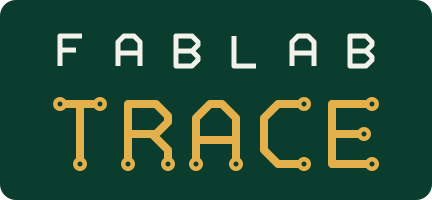

<h1 align="center"></h1>

<em>TRACE : <strong>T</strong>hings, <strong>R</strong>eflow, <strong>A</strong>I, <strong>C</strong>ircuits, <strong>E</strong>mbedded.</em>

Le **fablab électronique et informatique embarquée** du [lycée Rouvière – Suzanne Lefort-Rouquette](https://www.lycee-rouviere.fr/)
à Toulon est un atelier de fabrication numérique **orienté vers l'électronique**.
On y conçoit, on y assemble, on y programme et on y teste des systèmes
électroniques communicants, du composant CMS à l'intelligence artificielle
embarquée.

Ce dépôt rassemble la documentation du fablab, les activités pratiques qui s'y
déroulent et les projets qui y sont menés.

> Ce dépôt est hébergé dans l'organisation GitHub du
> [BTS CIEL](https://www.lycee-rouviere.fr/index.php/superieur/b-t-s/systemes-numeriques-option-b)
> (*Cybersécurité, Informatique et réseaux, Électronique*), mais le fablab est
> celui du lycée, pas celui d'une seule formation.

## Ce que l'on fait au fablab

### Assemblage de cartes électroniques en composants CMS

Les composants montés en surface (CMS) sont la norme de l'électronique
moderne. Le fablab permet de réaliser soi-même le cycle complet d'assemblage
d'une carte :

- dépose de la crème à braser sur les pastilles du circuit imprimé ;
- **placement des composants** à l'aide d'une table de placement ;
- **brasage par refusion** dans un four à refusion, en suivant un profil
  thermique adapté à la crème à braser et aux composants ;
- contrôle et reprise éventuelle des soudures, puis test de la carte.

C'est l'occasion de comprendre les contraintes de fabrication (empreintes,
tolérances, profil thermique) et de les prendre en compte dès la conception.

### Informatique embarquée

Des cartes programmables pour donner de l'intelligence aux systèmes :

- **Arduino UNO Q**, qui associe un microcontrôleur temps réel à un processeur
  capable de faire tourner Linux ;
- **Raspberry Pi 5**, ordinateur monocarte pour les applications embarquées
  plus lourdes (traitement, vision, serveurs, passerelles).

### Internet des objets (IoT)

Concevoir des objets qui mesurent, commandent et communiquent : capteurs,
actionneurs, protocoles de communication sans fil et filaires, passerelles,
supervision et exploitation des données à distance.

### IA embarquée

Faire tourner des modèles d'apprentissage automatique au plus près du capteur,
sur des cibles à ressources limitées : classification, détection, analyse de
signaux ou d'images, sans dépendre du nuage.

## Organisation du dépôt

| Dossier | Contenu |
|---|---|
| [`doc/`](doc/) | Documentation du matériel et des logiciels utilisés au fablab |
| [`labs/`](labs/) | Activités pratiques (travaux pratiques, tutoriels guidés) |
| [`projects/`](projects/) | Projets en cours ou réalisés au fablab |

Documentation déjà disponible :

- [Analog Discovery Studio — manuel de référence](doc/AnalogDevice/DiscoveryStudio/)
  (traduction française) : l'instrumentation de laboratoire (oscilloscope,
  générateur de signaux, analyseur logique, alimentations, etc.) en poste fixe.
- [Analog Discovery 3 — manuel de référence](doc/AnalogDevice/AnalogDiscovery3/)
  (traduction française) : la version de poche du même type d'instrumentation,
  avec en plus un traceur de courbes.

## Langue

La documentation est rédigée en **français**, langue d'enseignement. Les
extraits de code sont commentés en anglais.

## Licence

**Documentation, textes et illustrations** : [Creative Commons Attribution 4.0
International](LICENSE) (CC BY 4.0). Vous pouvez les partager et les adapter, y
compris à des fins commerciales, à condition de citer l'auteur :

> Pascal JEAN (epsilonrt), lycée Rouvière, Toulon —
> https://github.com/btsciel-toulon/fablab

**Extraits de code et fichiers de configuration** : libres, sans obligation
d'attribution.

**Exception** : les documents qui reprennent ou traduisent des ressources de
tiers conservent la licence d'origine, indiquée dans leur dossier. C'est le cas
des traductions des manuels de l'[Analog Discovery Studio](doc/AnalogDevice/DiscoveryStudio/)
et de l'[Analog Discovery 3](doc/AnalogDevice/AnalogDiscovery3/), soumises à la
licence CC BY-NC-SA 4.0 de Digilent.
