# Manuel de référence de l'Analog Discovery 3

> **Traduction française non officielle** de la page
> [Analog Discovery 3 Reference Manual](https://digilent.com/reference/test-and-measurement/analog-discovery-3/reference-manual)
> de Digilent (© Digilent), d'après la copie de la
> [Wayback Machine du 11 mars 2025](https://web.archive.org/web/20250311181056/https://digilent.com/reference/test-and-measurement/analog-discovery-3/reference-manual).
> En cas de doute, seule la version originale en anglais fait foi.
>
> Ce document est placé, comme l'original, sous licence
> [Creative Commons Attribution – Pas d'Utilisation Commerciale – Partage dans les Mêmes Conditions 4.0 International](https://creativecommons.org/licenses/by-nc-sa/4.0/deed.fr)
> (CC BY-NC-SA 4.0) — voir le fichier [LICENSE](LICENSE). Les images sont
> copiées depuis le site de Digilent et restent soumises à la même licence.
> Modifications apportées : traduction en français, mise en forme Markdown,
> copie locale des images (les trois captures d'écran de la galerie d'en-tête
> qui illustrent une section précise ont été replacées dans cette section).

## Sommaire

- [Présentation](#présentation)
- [Oscilloscope](#oscilloscope)
- [Générateur de signaux](#générateur-de-signaux)
- [Alimentations](#alimentations)
- [Voltmètre](#voltmètre)
- [Enregistreur de données](#enregistreur-de-données)
- [Analyseur logique](#analyseur-logique)
- [Générateur de motifs](#générateur-de-motifs)
- [E/S statiques](#es-statiques)
- [Analyseur de spectre](#analyseur-de-spectre)
- [Analyseur de réseau](#analyseur-de-réseau)
- [Analyseur d'impédance](#analyseur-dimpédance)
- [Traceur de courbes](#traceur-de-courbes)
- [Analyseur de protocoles](#analyseur-de-protocoles)
- [Éditeur de scripts WaveForms](#éditeur-de-scripts-waveforms)
- [Fonctionnalités supplémentaires](#fonctionnalités-supplémentaires)
  - [Logiciels du fabricant](#logiciels-du-fabricant)
  - [Logiciels tiers](#logiciels-tiers)
  - [Fréquence d'horloge système réglable](#fréquence-dhorloge-système-réglable)
  - [Horloge externe](#horloge-externe)
  - [Système de déclenchement](#système-de-déclenchement)
  - [Configuration de l'appareil](#configuration-de-lappareil)
  - [Paramètres des E/S numériques](#paramètres-des-es-numériques)
  - [Embase MTE](#embase-mte)
  - [États de la LED](#états-de-la-led)

## Présentation

L'Analog Discovery 3™ de Digilent, dont les circuits sont fabriqués par Texas
Instruments, est un appareil de test et de mesure multifonction qui permet de
mesurer, visualiser, générer, enregistrer et piloter des circuits à signaux
mixtes de toutes sortes. Peu coûteux, l'Analog Discovery 3 est assez petit pour
tenir dans une poche, mais assez puissant pour remplacer une pile
d'instruments de laboratoire : il offre aux étudiants en ingénierie, aux
amateurs et aux passionnés d'électronique la liberté de travailler sur des
circuits analogiques et numériques dans pratiquement n'importe quel
environnement, dans ou hors du laboratoire.

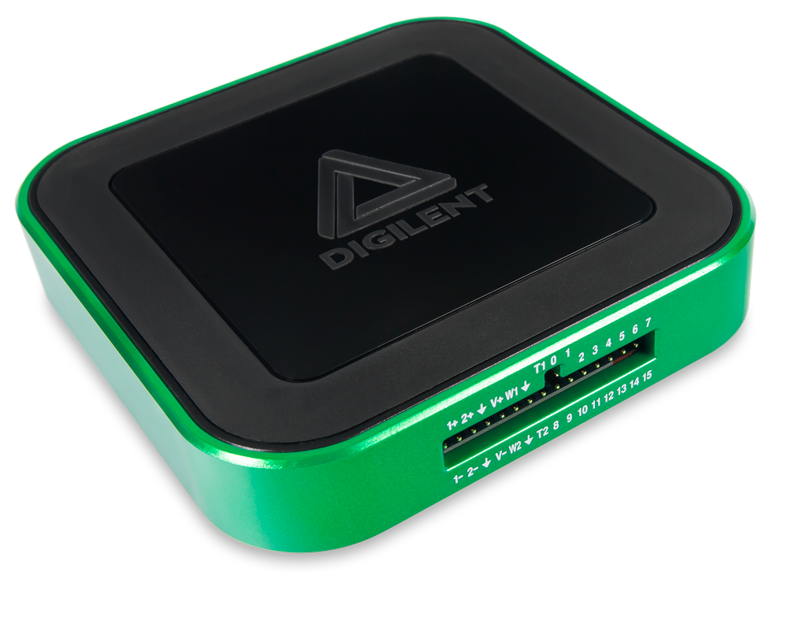

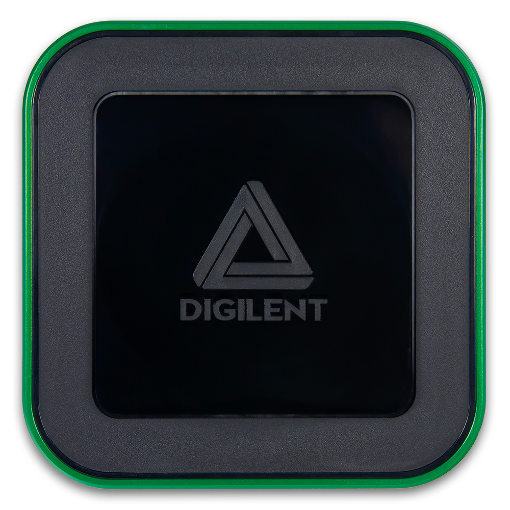

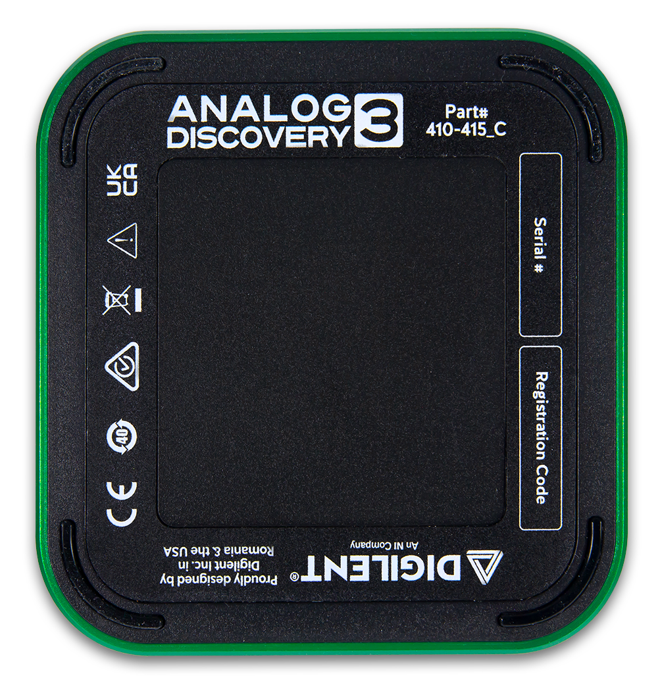

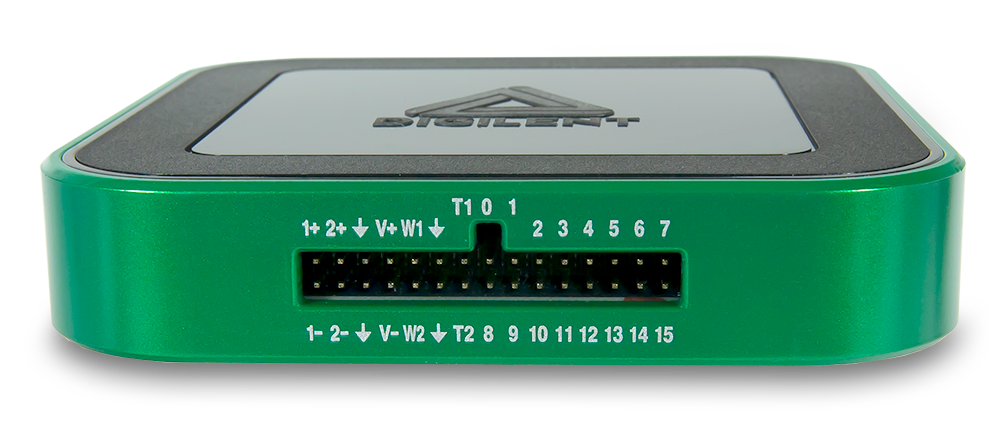

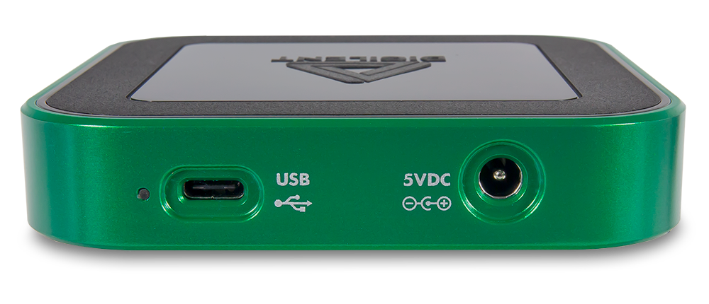

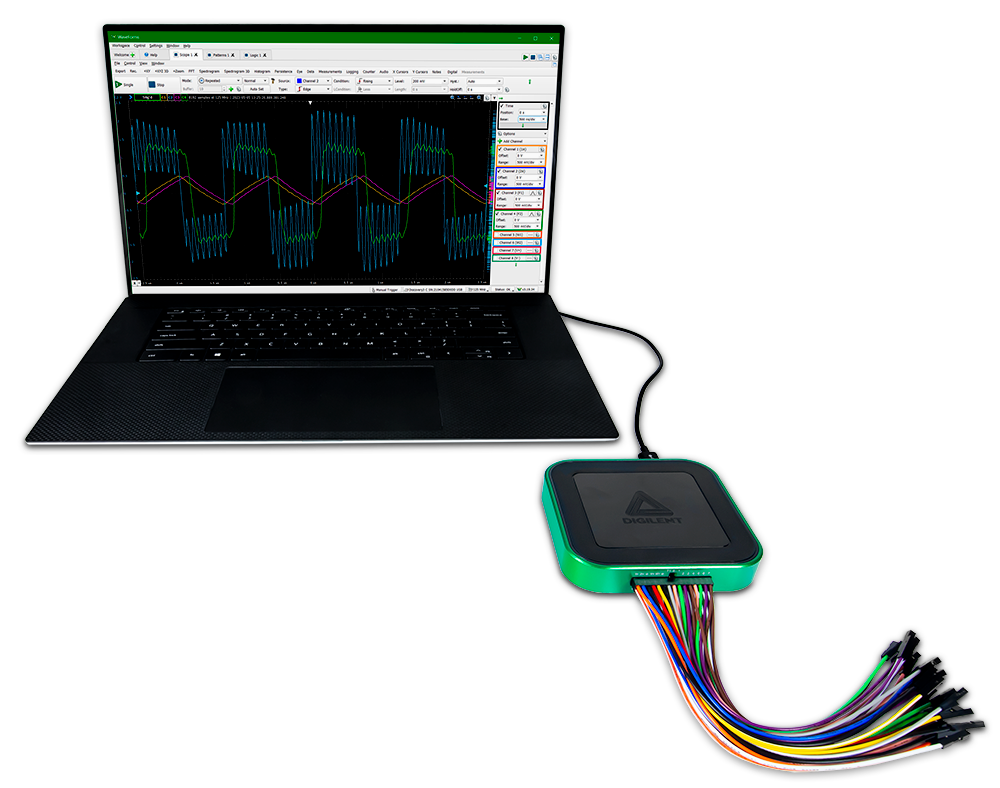

## Oscilloscope

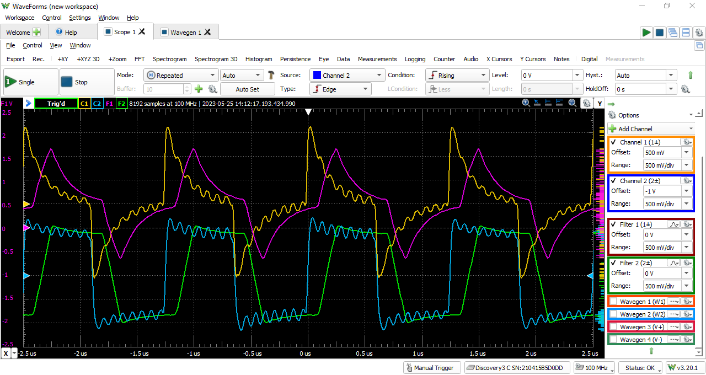

#### Points forts

- Deux voies différentielles, résolution 14 bits, jusqu'à 125 MS/s par voie
- Plage d'entrée de ±25 V, bande passante de 9 MHz avec les câbles MTE, plus de
  30 MHz avec l'adaptateur BNC
- Filtres d'entrée configurables par l'utilisateur et amplificateur à détection
  synchrone (lock-in)
- Vues FFT, spectrogramme, diagramme de l'œil, tracé XY, et bien d'autres
- Fenêtrages rectangulaire, triangulaire, Hamming, Hann, cosinus, flat-top,
  Blackman-Harris et Kaiser
- Déclenchement : sur front, impulsion, transition, hystérésis, et bien
  d'autres
- Déclenchement croisé avec l'analyseur logique, le générateur de signaux, le
  générateur de motifs ou un déclencheur externe
- Rebouclage numérique (loopback) des canaux de sortie analogiques
- Plusieurs voies mathématiques avec des fonctions complexes
- Curseurs avec mesures avancées
- Les données acquises peuvent être exportées dans des formats standard
- Les configurations de l'oscilloscope peuvent être enregistrées, exportées et
  importées

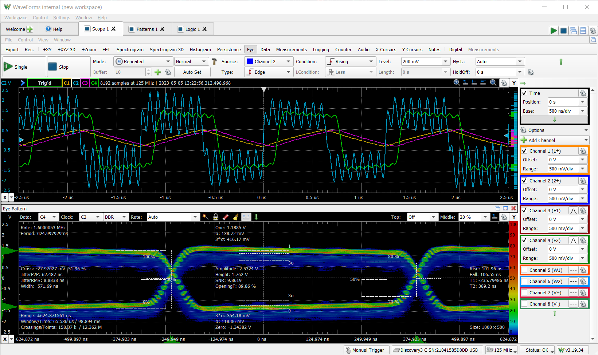

L'Analog Discovery 3 peut être utilisé avec l'instrument Scope (oscilloscope)
de WaveForms pour acquérir des données analogiques sur les canaux d'entrée
analogiques, avec des câbles BNC ou des câbles MTE. Dans ce cas, les canaux
d'entrée analogiques de l'Analog Discovery 3 fonctionnent comme un oscilloscope
à deux voies, avec une résolution de 14 bits jusqu'à 125 MS/s. Les échantillons
eux-mêmes sont stockés au format 16 bits : une résolution supérieure est donc
disponible à des cadences plus basses, avec une résolution de 15 bits lorsque
l'échantillonnage se fait à la moitié de la fréquence système et de 16 bits à un
quart de la [fréquence d'horloge système réglable](#fréquence-dhorloge-système-réglable)
ou moins. Il est possible d'acquérir, à des cadences plus lentes, davantage
d'échantillons que ne le permet la [configuration de l'appareil](#configuration-de-lappareil),
grâce au mode Record (enregistrement). L'enregistrement peut se faire
directement dans un fichier (avec compression facultative) ou en utilisant la
mémoire vive de l'ordinateur hôte comme tampon jusqu'à la fin de l'acquisition.

L'[adaptateur BNC](https://digilent.com/reference/test-and-measurement/bnc-adapter-board/start)
peut être utilisé avec l'Analog Discovery 3 pour brancher des câbles BNC à
l'oscilloscope et obtenir ainsi une bande passante nettement supérieure à celle
des câbles MTE. Notez que, lorsque l'AD3 est utilisé avec l'adaptateur BNC, les
canaux d'oscilloscope de l'adaptateur sont asymétriques (single-ended) et que le
circuit sous test doit toujours partager une masse commune avec l'Analog
Discovery 3.

Avec des câbles MTE, les broches positive (**+**) et négative (**-**) de chaque
canal de l'oscilloscope forment une paire différentielle. Les broches négatives
(**-**) peuvent être reliées à un nœud du circuit qui n'est pas la masse, mais
le circuit sous test doit toujours partager une masse commune avec l'Analog
Discovery 3 et continuer de respecter la plage d'entrée de ±25 V.

> **Remarque importante : mise à la masse du circuit**
> Bien que les canaux d'entrée analogiques de l'Analog Discovery 3 soient
> entièrement différentiels, une connexion de masse (GND) avec le circuit sous
> test est nécessaire pour fournir une tension de mode commun stable.
>
> La référence de masse (GND) de l'Analog Discovery 3 est reliée à la masse de
> l'USB. Selon le mode d'alimentation du PC et ses autres connexions (Ethernet,
> audio, etc., qui peuvent elles aussi être reliées à la terre), la référence de
> masse de l'Analog Discovery 3 peut se retrouver reliée à l'ensemble du système
> de masse et, au final, à la protection du réseau électrique (terre). Le
> circuit sous test peut lui aussi être relié à la terre ou, éventuellement,
> flottant.
>
> Pour des raisons de sécurité, il incombe à l'utilisateur de comprendre le
> schéma d'alimentation et de mise à la masse, et de s'assurer qu'il existe une
> référence de masse commune entre l'Analog Discovery 3 et le circuit sous test.
> Pour obtenir des mesures sans distorsion, les tensions de mode commun et
> différentielle doivent respecter, sans les dépasser, les
> [caractéristiques](https://digilent.com/reference/test-and-measurement/analog-discovery-3/specifications).

Les canaux d'entrée analogiques de l'Analog Discovery 3 étant partagés entre
les instruments, l'instrument Oscilloscope ne peut pas être utilisé en même
temps que d'autres instruments, notamment le Voltmètre, l'Enregistreur de
données, l'Analyseur de spectre, l'Analyseur de réseau, l'Analyseur
d'impédance ou le Traceur de courbes.

L'Analog Discovery 3 dispose d'un petit tampon de bruit distinct, qui stocke les
valeurs d'échantillon minimale et maximale relevées pendant l'acquisition. Elles
sont représentées à l'écran par une bande semi-transparente à l'arrière-plan du
tracé, afin de signaler les parasites (glitches) ou les composantes de
fréquence plus élevée lorsque la cadence d'échantillonnage est inférieure à la
fréquence système. L'acquisition du bruit peut être désactivée pour obtenir une
cadence d'acquisition plus rapide.

En plus des deux canaux d'entrée analogiques physiques, l'Analog Discovery 3
prend en charge le rebouclage numérique des données envoyées au générateur de
signaux (Wavegen) et aux alimentations, pour afficher les sorties configurées
sous forme de traces dans la vue de tracé du Scope. Cela permet de visualiser
facilement des signaux de référence idéalisés des sorties et de les utiliser
pour des calculs et des filtres dans l'application.

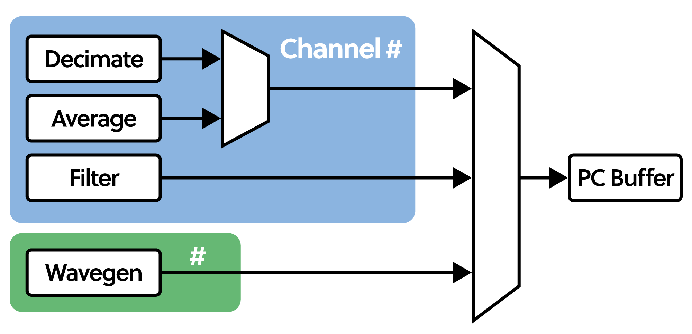

*Figure 1. Sources de données matérielles pouvant être affichées dans la vue de
tracé du Scope.*

Des filtres matériels et logiciels sont disponibles dans l'instrument Scope,
sous forme de voies supplémentaires à afficher sur le tracé. Un filtre FIR
matériel, avec différentes fonctions de fenêtrage, est disponible comme voie
supplémentaire pour chacune des deux entrées analogiques de l'Analog Discovery 3.
Chaque filtre matériel peut être configuré pour utiliser les données
moyennées, décimées ou brutes du CAN (convertisseur analogique-numérique)
associé à son entrée d'oscilloscope.

Des voies logicielles, calculées par le logiciel WaveForms sur l'ordinateur
hôte, peuvent également être ajoutées au tracé. Ces voies et filtres logiciels
comprennent des opérations arithmétiques simples, comme le calcul de la
puissance totale consommée par un système, des filtres IIR de Butterworth et de
Tchebychev pour le traitement du signal, des amplificateurs à détection
synchrone (lock-in) pour extraire un signal du bruit environnant, et des
fonctions mathématiques programmables par script. Chaque voie logicielle peut
utiliser n'importe quelle voie matérielle ou logicielle existante comme source
de ses entrées.

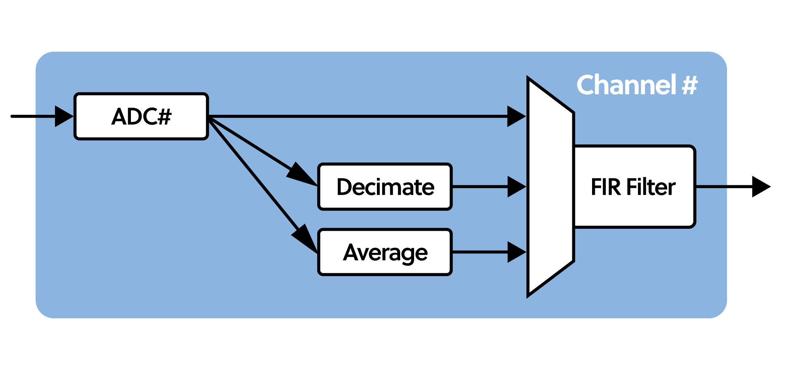

*Figure 2. Diagramme d'acquisition matérielle et de filtrage de l'oscilloscope.*

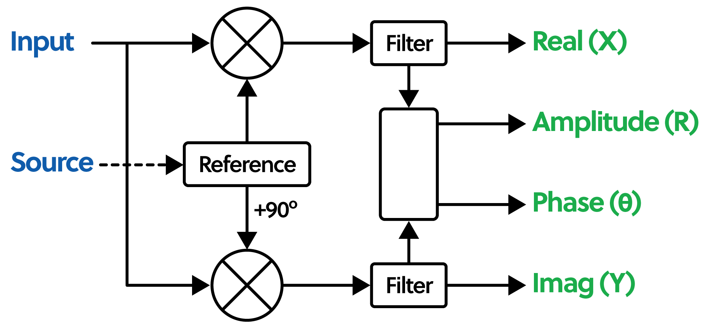

*Figure 3. Diagramme de l'amplificateur à détection synchrone (lock-in) de
l'oscilloscope.*

Pour plus d'informations sur les canaux d'entrée analogiques, consultez les
[caractéristiques de l'Analog Discovery 3](https://digilent.com/reference/test-and-measurement/analog-discovery-3/specifications).
Pour une présentation pas à pas des fonctions de l'instrument Scope de
WaveForms, consultez le guide
[Using the Oscilloscope](https://digilent.com/reference/test-and-measurement/guides/waveforms-oscilloscope)
(en anglais). Des informations sur la
[fréquence d'horloge système réglable](#fréquence-dhorloge-système-réglable) et
sur le [système de déclenchement](#système-de-déclenchement) se trouvent dans
leurs sections respectives du présent document.

---

## Générateur de signaux

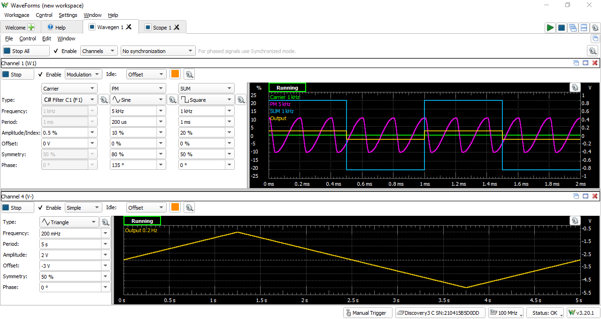

#### Points forts

- Deux voies, résolution 14 bits, jusqu'à 125 MS/s par voie
- Plage de sortie de ±5 V, bande passante de 9 MHz avec les câbles MTE, 12 MHz
  avec l'adaptateur BNC
- Signaux standard : sinus, triangle, dent de scie, bruit, rampe montante, rampe
  descendante, tension continue, et bien d'autres
- Signaux avancés : balayage (sweep), modulation et sommation (phase, AM, FM),
  fonctions mathématiques personnalisées et mode lecture (play)
- Rebouclage numérique des données d'entrée analogiques brutes, moyennées ou
  filtrées comme signaux de sortie
- Signaux arbitraires définis par l'utilisateur : dans l'interface du logiciel
  WaveForms ou avec des outils standard (par exemple Excel)
- Commande facultative des deux alimentations programmables par des signaux
  standard

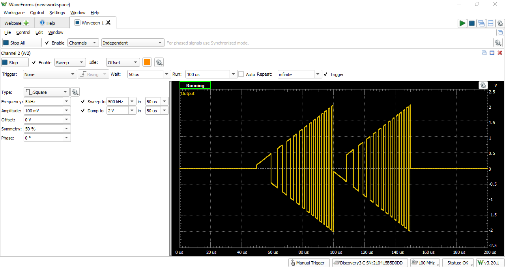

L'Analog Discovery 3 peut être utilisé avec l'instrument Wavegen (générateur de
signaux) de WaveForms pour produire des signaux de tension analogiques, avec des
câbles BNC ou des câbles MTE. Dans ce cas, les canaux de sortie analogiques de
l'Analog Discovery 3 fonctionnent comme un générateur de signaux arbitraires à
deux voies, avec une résolution de 14 bits jusqu'à 125 MS/s. Des tampons
distincts supplémentaires sont alloués à la modulation de fréquence ou de phase
(FM/PM) et à la modulation d'amplitude et à la sommation (AM/SUM), pour générer
des signaux complexes sur chacun des canaux de sortie analogiques. La taille des
tampons d'échantillons, à la fois pour les voies AWG principales et pour les
paramètres de modulation, se règle dans la
[configuration de l'appareil](#configuration-de-lappareil).

Si des charges très capacitives sont branchées sur les sorties analogiques, des
oscillations amorties (ringing) ou des dépassements peuvent apparaître sur les
signaux à fronts abrupts. On peut les atténuer avec l'[adaptateur BNC](https://digilent.com/reference/test-and-measurement/bnc-adapter-board/start),
en plaçant le cavalier sur la sélection d'impédance 50 Ω plutôt que sur les
0 Ω (non contrôlés précisément) utilisés par défaut par l'Analog Discovery 3.
L'adaptateur BNC permet aussi de brancher des câbles BNC au générateur de
signaux arbitraires pour obtenir une bande passante de sortie supérieure à celle
des câbles MTE.

En plus de la commande des deux sorties asymétriques (single-ended) avec des
signaux standard ou avancés, l'Analog Discovery 3 dispose de chemins de
rebouclage numérique qui permettent aux canaux de sortie analogiques d'utiliser
directement les données d'entrée analogiques brutes, moyennées ou filtrées de
l'instrument Scope. Les deux alimentations programmables peuvent aussi être
commandées séparément comme des générateurs de signaux standard lents (2,5 Hz
au maximum).

Les canaux de sortie analogiques de l'Analog Discovery 3 étant partagés,
l'instrument Wavegen ne peut pas être utilisé en même temps que l'Analyseur de
réseau ou l'Analyseur d'impédance. Si les deux sorties analogiques principales
ou les alimentations programmables sont pilotées directement depuis
l'[instrument Scope](#oscilloscope), les canaux concernés ne peuvent pas être
pilotés en même temps par l'instrument Wavegen.

Pour plus d'informations sur les canaux de sortie analogiques, consultez les
[caractéristiques de l'Analog Discovery 3](https://digilent.com/reference/test-and-measurement/analog-discovery-3/specifications).
Pour une présentation pas à pas des fonctions de l'instrument Wavegen de
WaveForms, consultez le guide
[Using the Waveform Generator](https://digilent.com/reference/test-and-measurement/guides/waveforms-waveform-generator)
(en anglais). Des informations sur la
[fréquence d'horloge système réglable](#fréquence-dhorloge-système-réglable) et
sur le [système de déclenchement](#système-de-déclenchement) se trouvent dans
leurs sections respectives du présent document.

---

## Alimentations

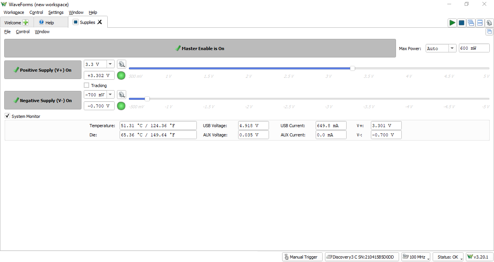

#### Points forts

- Deux alimentations programmables (0,5 V à 5 V, -0,5 V à -5 V)
- Suivi (tracking) facultatif entre les deux alimentations programmables
- Relevé intégré de la température du système, des tensions des rails de sortie
  et du courant tiré de la source
- Limites de puissance configurables pour éviter d'endommager le système

L'Analog Discovery 3 dispose de deux rails d'alimentation variables qui peuvent
alimenter des circuits externes sous test. Ces rails se règlent
respectivement entre 0,5 V et 5 V et entre -0,5 V et -5 V grâce à l'instrument
Supplies (Alimentations) de WaveForms. Cet instrument offre aussi le relevé
direct et intégré de la tension et du courant fournis par l'hôte, des tensions
de sortie des alimentations et de la température du système.

Le courant et la puissance maximaux disponibles en sortie dépendent du mode
d'alimentation de l'Analog Discovery 3. Alimenté par l'USB, l'Analog Discovery 3
consomme jusqu'à 700 mA (environ 3,5 W) sans aucun instrument en marche. Les
deux alimentations variables peuvent être utilisées jusqu'à ce que la puissance
de fonctionnement USB globale recommandée de 5,5 W soit atteinte.

Avec une alimentation auxiliaire de 5 V DC, dont le courant nominal recommandé
est de 3,1 A ou plus, chaque rail d'alimentation programmable peut fournir
jusqu'à 800 mA, avec une limite de puissance de 2,4 W par canal pour éviter la
surchauffe des composants internes des alimentations. Le risque de surchauffe de
l'appareil apparaît à partir de 10 W.

L'utilisateur peut définir sa propre limite de température de l'appareil et sa
propre limite de puissance pour l'Analog Discovery 3, afin de restreindre
davantage les conditions recommandées. Le réglage Max Power (puissance max.)
fixe la puissance totale fournie aux circuits matériels situés derrière les
alimentations utilisateur ; la puissance pouvant être fournie par les deux
alimentations sera inférieure à ce réglage et dépend, entre autres facteurs, de
la tension demandée par l'utilisateur, de la charge et du rapport cyclique des
circuits internes nécessaires pour maintenir la tension de sortie demandée.
Avec l'option Auto de la liste déroulante Max Power, WaveForms définit
automatiquement la puissance autorisée en fonction des capacités de l'USB ou de
la présence d'une alimentation auxiliaire.

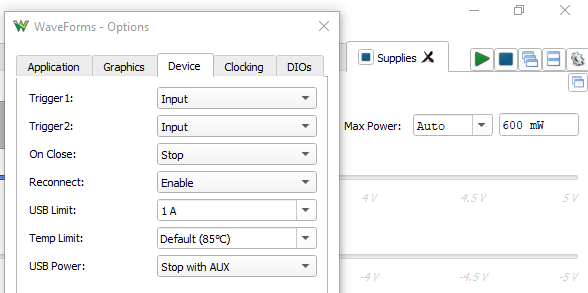

*Figure 4. Réglages des limites de puissance et de température des
alimentations.*

Pour plus d'informations sur les alimentations programmables, consultez les
[caractéristiques de l'Analog Discovery 3](https://digilent.com/reference/test-and-measurement/analog-discovery-3/specifications).
Pour une présentation pas à pas des fonctions de l'instrument Alimentations de
WaveForms, consultez le guide
[Using the Power Supplies](https://digilent.com/reference/test-and-measurement/guides/waveforms-supplies)
(en anglais).

---

## Voltmètre

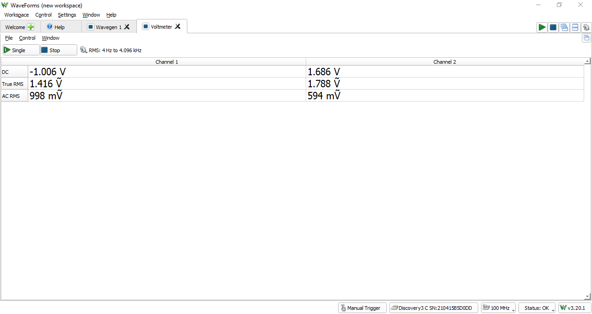

#### Points forts

- Mesures DC, AC RMS et True RMS

Les entrées analogiques de l'Analog Discovery 3 peuvent être utilisées avec
l'instrument Voltmeter de WaveForms pour réaliser un voltmètre simple. Les
tensions continues, les tensions alternatives efficaces (AC RMS) et les
tensions efficaces vraies (True RMS) peuvent être affichées pour chacune des
deux voies Scope.

Les canaux d'entrée analogiques de l'Analog Discovery 3 étant partagés,
l'instrument Voltmètre ne peut pas être utilisé en même temps que les
instruments Oscilloscope, Enregistreur de données, Analyseur de spectre,
Analyseur de réseau ou Analyseur d'impédance.

Pour plus d'informations sur les canaux d'entrée analogiques (« Scope »),
consultez les [caractéristiques de l'Analog Discovery 3](https://digilent.com/reference/test-and-measurement/analog-discovery-3/specifications).
Pour une présentation pas à pas des fonctions de l'instrument Voltmètre de
WaveForms, consultez le guide
[Using the Voltmeter](https://digilent.com/reference/test-and-measurement/guides/waveforms-voltmeter)
(en anglais).

---

## Enregistreur de données

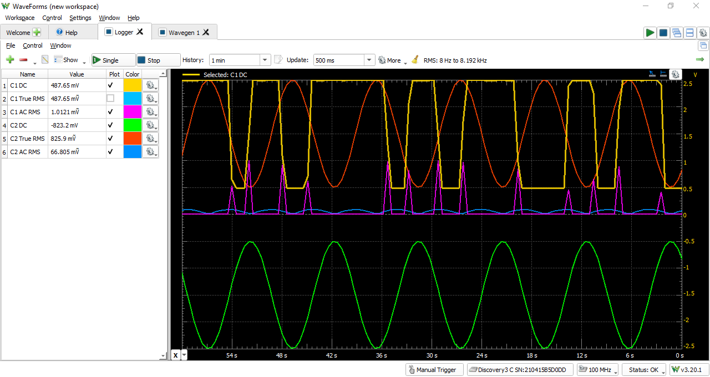

#### Points forts

- Mesures DC, AC RMS et True RMS
- Capable d'enregistrer en continu pendant 60 jours
- Mesures personnalisées programmables par script

L'Analog Discovery 3 peut être utilisé avec l'instrument Logger de WaveForms
pour capturer des données analogiques d'entrée sur une longue période.

L'enregistreur de données peut capturer des données à des cadences de mise à
jour allant jusqu'à 10 échantillons par seconde. La durée maximale d'un
enregistrement dépend de la cadence de mise à jour mais, à l'extrême, il peut
durer plus de mille heures. D'autres configurations et options d'enregistrement
sont disponibles avec le mode Record de l'[instrument Scope](#oscilloscope).

Les canaux d'entrée analogiques de l'Analog Discovery 3 étant partagés,
l'instrument Enregistreur de données ne peut pas être utilisé en même temps que
les instruments Oscilloscope, Voltmètre, Analyseur de spectre, Analyseur de
réseau ou Analyseur d'impédance.

Pour plus d'informations sur les canaux d'entrée analogiques, consultez les
[caractéristiques de l'Analog Discovery 3](https://digilent.com/reference/test-and-measurement/analog-discovery-3/specifications).
Pour une présentation pas à pas des fonctions de l'instrument Logger de
WaveForms, consultez le guide
[Using the Data Logger](https://digilent.com/reference/test-and-measurement/guides/waveforms-data-logger)
(en anglais).

---

## Analyseur logique

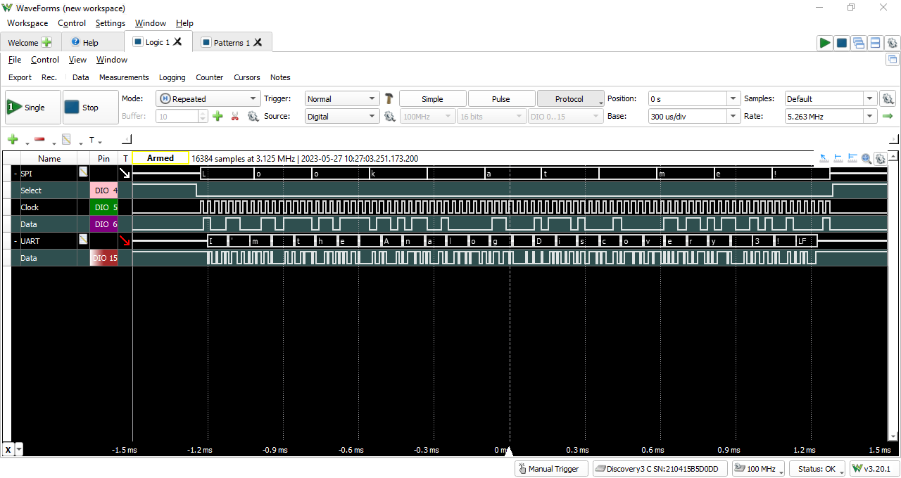

#### Points forts

- Interpréteurs pour SPI, I2C, UART, CAN, I2S, 1-Wire, PS/2, HDMI CEC, codes
  Manchester, JTAG, GPIB, SWD et les bus parallèles
- Protocoles personnalisés définis par script
- Nombreuses options de déclenchement, dont le changement d'état d'une broche,
  un motif sur un bus, et bien d'autres
- Déclenchement croisé entre les canaux d'entrée analogiques, l'analyseur
  logique, le générateur de motifs ou un déclencheur externe
- Import/export de fichiers de données dans des formats standard

L'Analog Discovery 3 peut être utilisé avec l'instrument Logic de WaveForms
comme analyseur logique. Dans ce cas, les 16 canaux d'entrée/sortie numériques
sont configurés pour capturer les états logiques haut/bas des broches
connectées ; ils peuvent s'interfacer avec des signaux logiques CMOS 3,3 V et
tolèrent des tensions jusqu'à 5 V. Il est possible d'acquérir, à des cadences
plus lentes, davantage d'échantillons que ne le permet la
[configuration de l'appareil](#configuration-de-lappareil), grâce au mode
Record. L'enregistrement peut se faire directement dans un fichier (avec
compression facultative) ou en utilisant la mémoire vive de l'ordinateur hôte
comme tampon jusqu'à la fin de l'acquisition.

Les canaux d'entrée/sortie peuvent être regroupés en bus et en protocoles. Les
groupes de protocoles permettent d'afficher le contenu décodé des paquets de
nombreux protocoles de communication courants, notamment SPI, I2C, UART, CAN et
I2S. Les états des signaux, les valeurs de bus décodées et les protocoles
décodés peuvent servir à déclencher une capture de l'analyseur logique. Les
déclenchements sur protocole comprennent des événements propres à chaque
protocole, comme le début de transmission, la fin de transmission ou un contenu
de paquet correspondant à une valeur donnée.

Les canaux d'entrée/sortie numériques utilisés par l'instrument Analyseur
logique peuvent toujours être utilisés par d'autres instruments qui se servent
des mêmes canaux. De plus, la force d'attaque (drive) et les résistances de
rappel internes peuvent être modifiées dans les
[paramètres des E/S numériques](#paramètres-des-es-numériques).

Pour plus d'informations sur les canaux d'entrée/sortie numériques, consultez
les [caractéristiques de l'Analog Discovery 3](https://digilent.com/reference/test-and-measurement/analog-discovery-3/specifications).
Pour une présentation pas à pas des fonctions de l'instrument Analyseur logique
de WaveForms, consultez le guide
[Using the Logic Analyzer](https://digilent.com/reference/test-and-measurement/guides/waveforms-logic-analyzer)
(en anglais). Des informations sur la
[fréquence d'horloge système réglable](#fréquence-dhorloge-système-réglable) et
sur le [système de déclenchement](#système-de-déclenchement) se trouvent dans
leurs sections respectives du présent document.

---

## Générateur de motifs

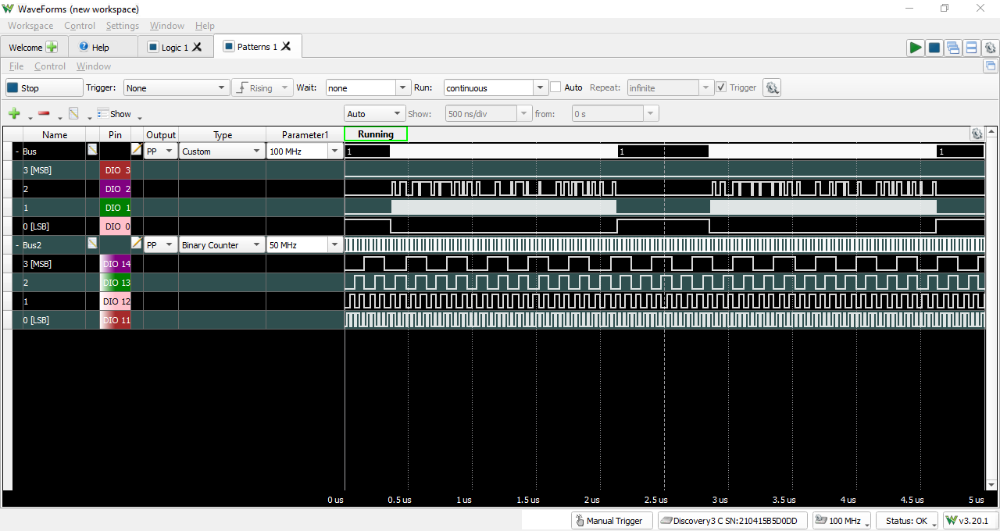

#### Points forts

- Plusieurs motifs prédéfinis, dont Clock (horloge), Pulse (impulsion), compteur
  binaire, compteur Gray, compteur Johnson, Walking 0/1, compteur décimal et
  bruit
- Motifs personnalisés définis par l'utilisateur et logique ROM à table de
  vérité
- Import/export de fichiers de données dans des formats standard
- Déclenchement croisé entre les canaux d'entrée analogiques, l'analyseur
  logique, le générateur de motifs ou un déclencheur externe

L'Analog Discovery 3 peut être utilisé avec l'instrument Patterns de WaveForms
pour générer des séquences de signaux logiques sur les broches d'entrée/sortie
numériques CMOS 3,3 V, à une cadence d'échantillonnage pouvant atteindre
125 MS/s. Chaque broche, ou chaque groupe de broches défini par l'utilisateur,
peut être configuré en logique push-pull, drain ouvert, source ouverte ou trois
états.

Des motifs prédéfinis, comme une impulsion d'horloge ou un compteur Johnson,
peuvent être choisis comme type de motif, de même que des motifs personnalisés
pour des systèmes plus spécifiques. De simples machines à états peuvent être
créées avec l'option de logique ROM pour des groupes de broches numériques.

Les canaux d'entrée/sortie numériques utilisés individuellement par l'instrument
Générateur de motifs peuvent toujours être utilisés par d'autres instruments ;
toutefois, les autres instruments ne peuvent utiliser ces canaux partagés qu'en
entrée. De plus, la force d'attaque (drive), la vitesse de balayage (slew rate)
et les résistances de rappel internes peuvent être modifiées dans les
[paramètres des E/S numériques](#paramètres-des-es-numériques).

Pour plus d'informations sur les canaux d'entrée/sortie numériques, consultez
les [caractéristiques de l'Analog Discovery 3](https://digilent.com/reference/test-and-measurement/analog-discovery-3/specifications).
Pour une présentation pas à pas des fonctions de l'instrument Générateur de
motifs de WaveForms, consultez le guide
[Using the Pattern Generator](https://digilent.com/reference/test-and-measurement/guides/waveforms-pattern-generator)
(en anglais). Des informations sur la
[fréquence d'horloge système réglable](#fréquence-dhorloge-système-réglable) et
sur le [système de déclenchement](#système-de-déclenchement) se trouvent dans
leurs sections respectives du présent document.

---

## E/S statiques

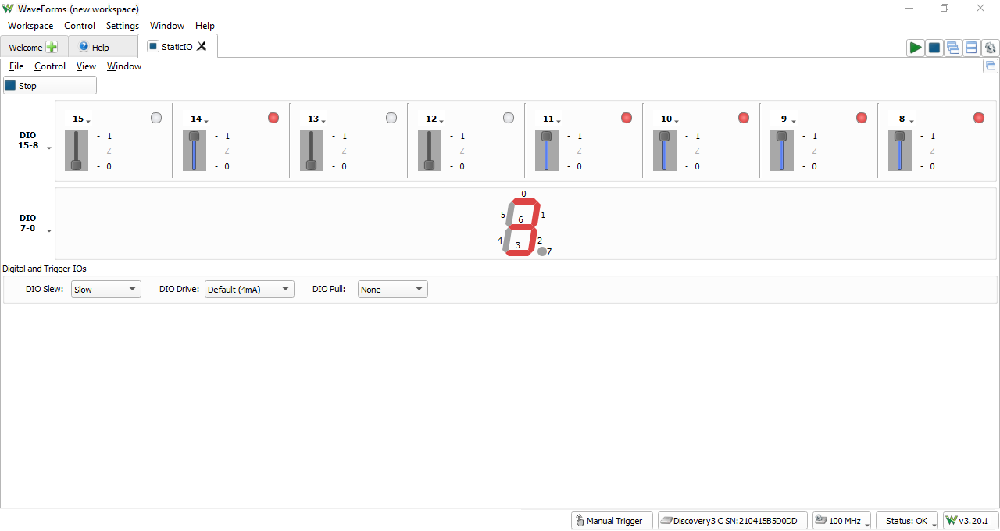

#### Points forts

- Dispositifs d'E/S virtuels (LED, boutons, interrupteurs et afficheurs)
- Contrôle facile des caractéristiques électriques des E/S numériques (DIO)

L'Analog Discovery 3 peut être utilisé avec l'instrument Static I/O de
WaveForms pour émuler divers dispositifs d'entrée/sortie utilisateur sur les
broches d'entrée/sortie numériques. Des LED, boutons, interrupteurs, curseurs et
afficheurs virtuels peuvent être affectés à des broches d'E/S numériques
précises, puis manipulés dans l'interface de WaveForms.

Les canaux d'entrée/sortie numériques de l'Analog Discovery 3 utilisent la
logique CMOS 3,3 V en entrée comme en sortie, et tolèrent des signaux d'entrée
jusqu'à 5 V. La force d'attaque (drive), les résistances de rappel internes et la
vitesse de balayage (slew) peuvent être modifiées directement dans cet
instrument. Des informations complémentaires figurent dans la section
[Paramètres des E/S numériques](#paramètres-des-es-numériques).

Les canaux d'entrée/sortie numériques utilisés par l'instrument E/S statiques
peuvent toujours être utilisés par d'autres instruments qui se servent des
mêmes canaux ; toutefois, les autres instruments ne peuvent utiliser ces canaux
partagés qu'en entrée.

Pour plus d'informations sur les canaux d'entrée/sortie numériques, consultez
les [caractéristiques de l'Analog Discovery 3](https://digilent.com/reference/test-and-measurement/analog-discovery-3/specifications).
Pour une présentation pas à pas des fonctions de l'instrument E/S statiques de
WaveForms, consultez le guide
[Using the Static I/O](https://digilent.com/reference/test-and-measurement/guides/waveforms-static-io)
(en anglais).

---

## Analyseur de spectre

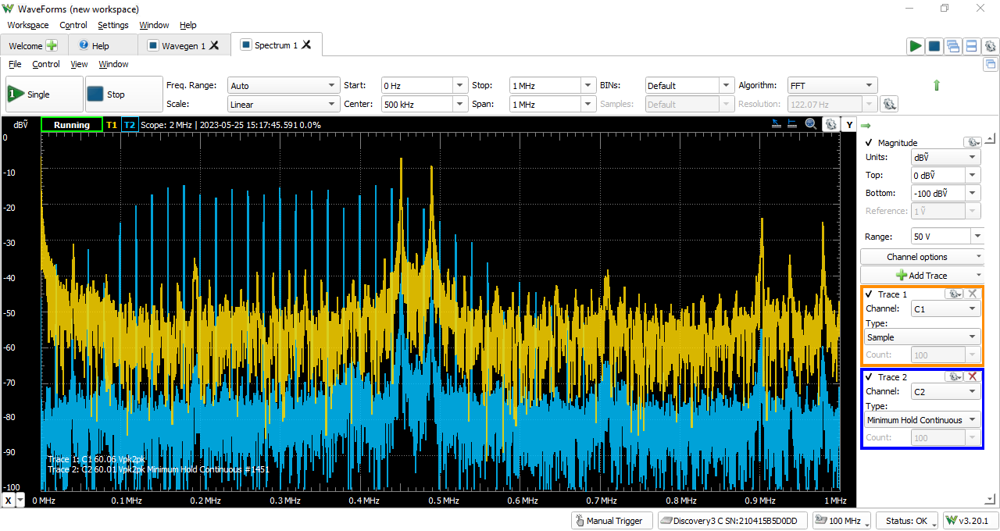

#### Points forts

- Algorithmes de spectre de puissance FFT et CZT
- Modes de plage de fréquences réglables : centre/étendue, début/fin
- Échelle linéaire ou logarithmique
- Plusieurs options d'axe vertical : tension crête, tension efficace, dBV, dBu,
  dBVS, et bien d'autres
- Fenêtrages rectangulaire, triangulaire, Hamming, Hann, cosinus, flat-top,
  Blackman-Harris et Kaiser
- Modes d'affichage de chaque trace : Sample, Peak Hold, Minimum Hold
  Continuous, moyenne RMS linéaire, et bien d'autres
- Import/export de fichiers de données dans des formats standard

L'Analog Discovery 3 peut être utilisé avec l'instrument Spectrum de WaveForms
pour visualiser la puissance des composantes fréquentielles des signaux
analogiques capturés sur les canaux d'entrée analogiques. Une transformée de
Fourier rapide (FFT) ou une transformée en Z chirp (algorithme de Bluestein)
peut servir de transformée de Fourier discrète.

Le nombre maximal d'échantillons, et donc de points de fréquence (bins),
dépend de la taille du tampon du Scope sélectionné dans le gestionnaire
d'appareils de WaveForms (Device Manager) et de l'algorithme choisi. L'instrument
Spectrum peut atteindre une fréquence maximale égale à la moitié de la
[fréquence d'horloge système réglable](#fréquence-dhorloge-système-réglable).

Les canaux d'entrée analogiques de l'Analog Discovery 3 étant partagés,
l'instrument Spectrum ne peut pas être utilisé en même temps que les
instruments Oscilloscope, Voltmètre, Enregistreur de données, Analyseur de
réseau ou Analyseur d'impédance.

Pour plus d'informations sur les canaux d'entrée analogiques, consultez les
[caractéristiques de l'Analog Discovery 3](https://digilent.com/reference/test-and-measurement/analog-discovery-3/specifications).
Pour une présentation pas à pas des fonctions de l'instrument Analyseur de
spectre de WaveForms, consultez le guide
[Using the Spectrum Analyzer](https://digilent.com/reference/test-and-measurement/guides/waveforms-spectrum-analyzer)
(en anglais).

---

## Analyseur de réseau

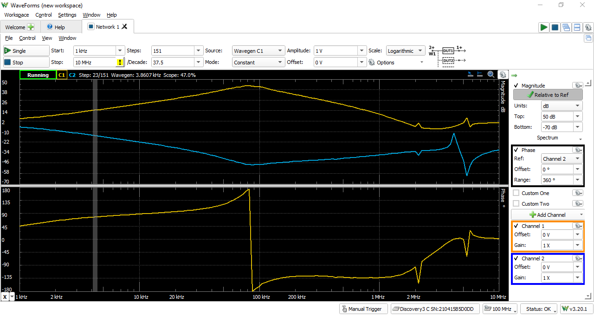

#### Points forts

- Diagrammes de Bode, de Nichols, de Nyquist et FFT
- Gain et offset d'entrée réglables
- Voie Wavegen ou signal externe sélectionnable comme source de fréquence
- Nombre d'échantillons, temps d'établissement et options de moyennage
  configurables pour chaque pas de fréquence
- Traces et calculs personnalisés disponibles
- Fenêtrages rectangulaire, triangulaire, Hamming, Hann, cosinus, flat-top et
  Blackman-Harris

L'Analog Discovery 3 peut être utilisé avec l'instrument Network de WaveForms
pour visualiser la réponse en amplitude et en phase d'un circuit sous test. Cet
instrument permet aussi d'afficher des diagrammes de Nichols et de Nyquist. Le
signal utilisé pour le balayage est personnalisable et utilise les mêmes
ressources que l'instrument Générateur de signaux ; il peut aussi être configuré
pour utiliser un signal externe comme entrée du circuit sous test, au lieu des
canaux de sortie analogiques.

Un balayage est effectué pour tester la réponse du circuit sur une plage de
fréquences allant de 20 µHz au minimum jusqu'à un quart de la
[fréquence d'horloge système réglable](#fréquence-dhorloge-système-réglable) au
maximum. La limite haute réellement exploitable de la plage de fréquences dépend
de la bande passante de la source du signal de fréquence, qu'elle soit générée
directement par l'Analog Discovery 3 ou par un système externe, ainsi que de la
bande passante des entrées analogiques de l'Analog Discovery 3. L'utilisation
d'un adaptateur comme l'[adaptateur BNC](https://digilent.com/reference/test-and-measurement/bnc-adapter-board/start)
avec l'Analog Discovery 3 peut améliorer considérablement la bande passante
haute atteignable.

Les canaux d'entrée et de sortie analogiques de l'Analog Discovery 3 étant
partagés, l'instrument Analyseur de réseau ne peut pas être utilisé en même
temps que les instruments Oscilloscope, Générateur de signaux, Voltmètre,
Enregistreur de données, Analyseur de spectre ou Analyseur d'impédance.

Pour plus d'informations sur les canaux de sortie et d'entrée analogiques,
consultez les [caractéristiques de l'Analog Discovery 3](https://digilent.com/reference/test-and-measurement/analog-discovery-3/specifications).
Pour une présentation pas à pas des fonctions de l'instrument Analyseur de
réseau de WaveForms, consultez le guide
[Using the Network Analyzer](https://digilent.com/reference/test-and-measurement/guides/waveforms-network-analyzer)
(en anglais).

---

## Analyseur d'impédance

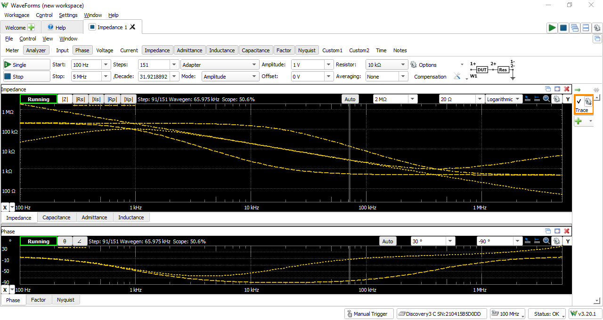

#### Points forts

- Vues graphiques pour le gain d'entrée, la tension, le courant, l'impédance,
  l'admittance, l'inductance, la capacité, Nyquist, personnalisée, et bien
  d'autres
- Vue Mètre simplifiée en alternative
- Topologies de circuit de compensation externe sélectionnables
- Export de fichiers de données dans des formats standard

L'Analog Discovery 3 peut être utilisé avec l'instrument Impedance de WaveForms
pour visualiser un large éventail de caractéristiques de la réponse en
fréquence d'un circuit sous test. Des tracés prédéfinis et personnalisés
permettent de présenter le résultat de nombreuses opérations mathématiques sur
les données mises en mémoire tampon.

Un balayage est généré par les sorties analogiques de l'Analog Discovery 3 pour
tester la réponse du circuit sur une plage de fréquences allant de 20 µHz à un
quart de la [fréquence d'horloge système réglable](#fréquence-dhorloge-système-réglable).
Différentes topologies du DUT (dispositif sous test) peuvent être choisies parmi
plusieurs préréglages, avec une amplitude et un offset configurables. Un
[adaptateur pour analyseur d'impédance](https://digilent.com/reference/add-ons/impedance-analyzer/start),
équipé de résistances de précision à 0,1 %, permet de simplifier le câblage du
circuit.

Les canaux d'entrée et de sortie analogiques de l'Analog Discovery 3 étant
partagés, l'instrument Analyseur d'impédance ne peut pas être utilisé en même
temps que les instruments Oscilloscope, Générateur de signaux, Voltmètre,
Enregistreur de données, Analyseur de spectre ou Analyseur de réseau. Si
l'adaptateur pour analyseur d'impédance est utilisé, les canaux numériques et
les alimentations servent en outre à commander les relais de la carte.

Pour plus d'informations sur les canaux de sortie et d'entrée analogiques,
consultez les [caractéristiques de l'Analog Discovery 3](https://digilent.com/reference/test-and-measurement/analog-discovery-3/specifications).
Pour une présentation pas à pas des fonctions de l'instrument Analyseur
d'impédance de WaveForms, consultez le guide
[Using the Impedance Analyzer](https://digilent.com/reference/test-and-measurement/guides/waveforms-impedance-analyzer)
(en anglais).

---

## Traceur de courbes

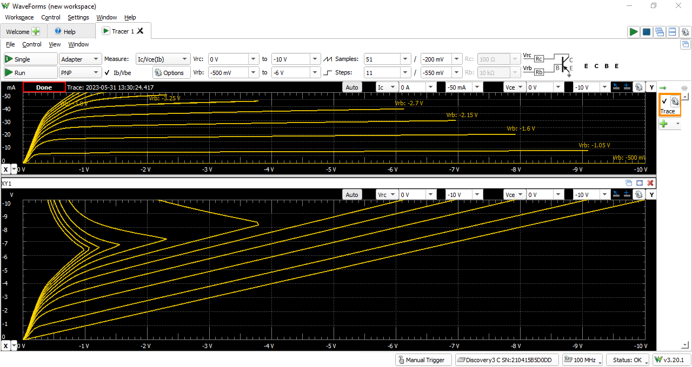

#### Points forts

- Fonctionne avec les diodes, les transistors NPN et PNP et les FET à canal P et
  N
- Réalise diverses mesures sélectionnables selon le dispositif sous test,
  couvrant de nombreuses combinaisons de calculs de tensions et de courants
  base/collecteur/émetteur et drain/grille/source
- Plages de balayage en tension et pas réglables

L'Analog Discovery 3 peut être utilisé avec l'instrument Tracer de WaveForms
pour tracer les courbes caractéristiques I-V de dispositifs comme les diodes,
les transistors NPN et PNP et les FET à canal P comme à canal N.

L'[adaptateur de test de transistors](https://digilent.com/reference/test-and-measurement/transistor-tester-adapter/start)
fournit le circuit de référence nécessaire, mais l'utilisateur peut aussi
réaliser son propre circuit externe. Des schémas de circuits de référence sont
fournis dans WaveForms, que l'adaptateur de test de transistors soit utilisé ou
non ; ils indiquent comment chaque patte du dispositif sous test doit être
reliée à l'Analog Discovery 3 ou à l'adaptateur.

Les canaux d'entrée et de sortie analogiques de l'Analog Discovery 3 étant
partagés, l'instrument Traceur de courbes ne peut pas être utilisé en même
temps que les instruments Oscilloscope, Générateur de signaux, Voltmètre,
Enregistreur de données, Analyseur de spectre ou Analyseur de réseau. De même,
lorsque l'adaptateur de test de transistors est utilisé, l'Analog Discovery 3
est limité à la limite de courant continu de commande (DC Current Drive) des
canaux de sortie analogiques.

Pour plus d'informations sur les canaux de sortie analogiques, consultez les
[caractéristiques de l'Analog Discovery 3](https://digilent.com/reference/test-and-measurement/analog-discovery-3/specifications).
Pour plus d'informations sur la réalisation d'un circuit de référence et sur
l'utilisation du Traceur en général, consultez le guide
[Using the WaveForms Curve Tracer](https://digilent.com/reference/test-and-measurement/guides/waveforms-curve-tracer)
(en anglais).

---

## Analyseur de protocoles

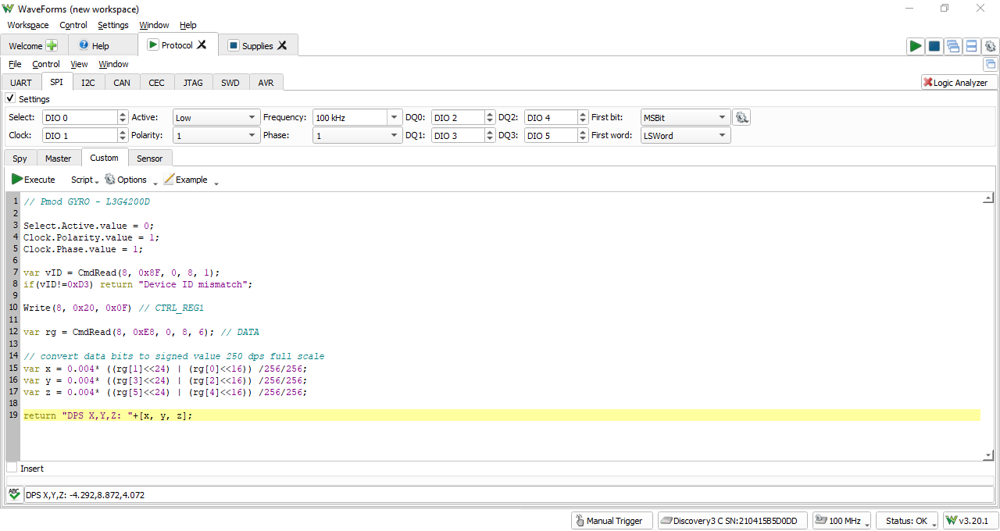

#### Points forts

- Prise en charge des protocoles UART, SPI, I2C, CAN, HDMI CEC, JTAG, SWD et AVR
- Séquences de transactions SPI, I2C et SWD programmables par script
- Débits, modes, polarité et autres paramètres configurables
- Enregistrement des transactions journalisées dans des fichiers de données

L'Analog Discovery 3 peut être utilisé avec l'instrument Protocol de WaveForms
pour travailler avec les protocoles de communication courants. Des transactions
UART, SPI, I2C, CAN, CEC, SWD et AVR peuvent être émises et reçues par l'Analog
Discovery 3, et tous les protocoles peuvent être espionnés sur n'importe lequel
des canaux d'entrée/sortie numériques. Des scripts personnalisés peuvent être
écrits dans l'instrument Analyseur de protocoles pour générer des séquences de
transactions SPI ou I2C. L'[instrument Logic](#analyseur-logique) peut
éventuellement être utilisé pour recevoir et déboguer directement les données
numériques entrantes.

L'[instrument Scripts](#éditeur-de-scripts-waveforms) permet de prendre en
charge plusieurs protocoles dans un même test, en ouvrant et en fermant
différents protocoles. On peut aussi utiliser l'[instrument Patterns](#générateur-de-motifs)
pour simuler un motif personnalisé reproduisant la sortie d'un protocole
prédéterminé.

Comme l'instrument Protocol utilise les mêmes ressources matérielles que les
instruments Analyseur logique et Générateur de motifs, l'Analyseur de protocoles
ne peut pas être utilisé en même temps que ces derniers et ne peut piloter
qu'un seul moteur de protocole à la fois.

Les canaux d'entrée/sortie numériques de l'Analog Discovery 3 utilisent la
logique CMOS 3,3 V en entrée comme en sortie, et tolèrent des signaux d'entrée
jusqu'à 5 V. La force d'attaque (drive), les résistances de rappel internes et la
vitesse de balayage (slew) peuvent être modifiées directement dans cet
instrument. Des informations complémentaires figurent dans la section
[Paramètres des E/S numériques](#paramètres-des-es-numériques).

Pour plus d'informations sur les canaux d'entrée/sortie numériques, consultez
les [caractéristiques de l'Analog Discovery 3](https://digilent.com/reference/test-and-measurement/analog-discovery-3/specifications).
Pour une présentation pas à pas des fonctions de l'instrument Analyseur de
protocoles de WaveForms, consultez le guide
[Using the Protocol Analyzer](https://digilent.com/reference/test-and-measurement/guides/waveforms-protocol-analyzer)
(en anglais).

---

## Éditeur de scripts WaveForms

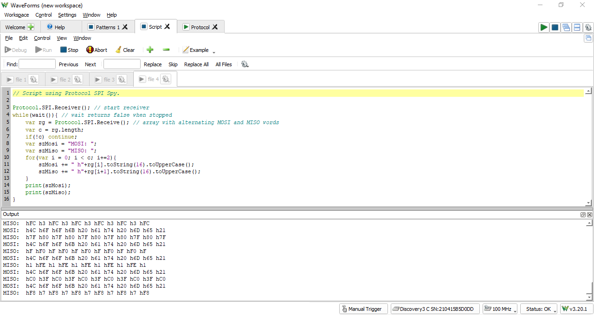

#### Points forts

- Disponible directement dans l'application WaveForms
- Pilotage simultané de tous les instruments en JavaScript
- Actions de l'interface graphique automatisables
- Fonctions personnalisées d'analyse et de traitement des données

Chacun des instruments de WaveForms peut être piloté par des scripts, dans
l'application WaveForms elle-même. L'instrument Script permet à l'utilisateur
d'écrire et d'exécuter du code JavaScript (fondé sur
[ECMAScript](https://doc.qt.io/qt-5/ecmascript.html) et la spécification
[ECMA-262](http://www.ecma-international.org/publications/standards/Ecma-262.htm))
qui pilote le reste de l'application WaveForms grâce à une API étendue. Il est
ainsi possible de configurer et de faire fonctionner simultanément de nombreux
instruments, de façon facilement reproductible. Lorsque l'on survole une action
pilotable par script dans l'interface graphique, la fonction de script
correspondante s'affiche dans le coin inférieur gauche de WaveForms.

L'instrument Script est destiné à automatiser certaines fonctions disponibles
dans les différents instruments, comme la modification d'une fréquence PWM sur
un nombre de passages prédéfini. D'autres opérations, comme la configuration des
voies, le nom donné à chaque trace ou la configuration statique, sont bien plus
faciles à réaliser dans l'interface graphique de l'instrument concerné que
depuis l'instrument Script. Comme chaque espace de travail (workspace) WaveForms
enregistre à la fois le script et les réglages de chaque instrument,
l'utilisateur peut définir différentes configurations d'un instrument, depuis
son interface propre comme depuis l'outil Script, sans avoir à tout définir et
paramétrer manuellement en un seul endroit.

Pour une présentation pas à pas des fonctions de l'instrument Script de
WaveForms, consultez le guide
[Using Scripts](https://digilent.com/reference/test-and-measurement/guides/waveforms-script-editor)
(en anglais).

---

## Fonctionnalités supplémentaires

### Logiciels du fabricant

#### WaveForms

WaveForms est l'application logicielle gratuite de test et de mesure de
Digilent, compatible avec tous les appareils de la famille Discovery de
Digilent. Disponible sous Mac, Linux et Windows, elle permet de configurer et de
piloter facilement tous les instruments virtuels offerts par l'Analog
Discovery 3.

Vous trouverez plus d'informations sur WaveForms, avec un guide de prise en main
et des exemples, dans le
[centre de ressources WaveForms](https://digilent.com/reference/software/waveforms/waveforms-3/start)
(en anglais).

#### Kit de développement logiciel (SDK) WaveForms

Le SDK WaveForms est un ensemble de bibliothèques logicielles et d'exemples,
inclus avec WaveForms, qui permettent de développer des applications
personnalisées pilotant les appareils de test et de mesure Digilent en dehors de
l'application WaveForms. Il prend en charge plusieurs langages, dont C/C++, C#,
MATLAB, Python et Visual Basic : l'utilisateur peut ainsi piloter facilement les
canaux matériels et les instruments virtuels de plusieurs appareils sans jamais
ouvrir WaveForms.

Vous trouverez plus d'informations sur le SDK WaveForms, avec un guide de prise
en main et des exemples, dans le
[centre de ressources du SDK WaveForms](https://digilent.com/reference/software/waveforms/waveforms-sdk/start)
(en anglais).

---

### Logiciels tiers

L'Analog Discovery 3 est pris en charge par des applications tierces, notamment
MATLAB et LabVIEW.

Un guide d'utilisation de WaveForms avec LabVIEW figure dans le
[guide de prise en main de LabVIEW de Digilent](https://digilent.com/reference/test-and-measurement/guides/getting-started-with-labview),
et un guide équivalent pour MATLAB dans le
[guide de prise en main de MATLAB de Digilent](https://digilent.com/reference/test-and-measurement/guides/matlab-getting-started)
(tous deux en anglais).

---

### Fréquence d'horloge système réglable

Chacun des principaux systèmes de l'AD3 — les entrées analogiques, les sorties
analogiques et les broches d'E/S numériques — voit sa cadence d'échantillonnage
pilotée par une horloge système réglable, de 50 MHz à 125 MHz, avec une valeur
par défaut de 100 MHz. L'utilisateur peut modifier la fréquence système dans les
options de l'appareil de WaveForms ; si la fréquence choisie manuellement ne peut
pas être obtenue, la fréquence réellement obtenue par le FPGA est indiquée.

L'horloge système peut être remplacée par une horloge de référence externe de
10 MHz à 50 MHz, fournie en entrée sur la broche du signal Trigger 1.

---

### Horloge externe

Par défaut, lorsque l'Analog Discovery 3 est utilisé seul ou produit une horloge
externe, un oscillateur local fournit un signal d'horloge à une PLL dédiée à
faible gigue, qui pilote les horloges du CAN et du CNA. Une PLL interne au FPGA
génère les horloges internes ainsi qu'une horloge basse fréquence, de 10 MHz à
50 MHz, qui peut éventuellement être présentée en sortie sur les deux broches
Trigger E/S.

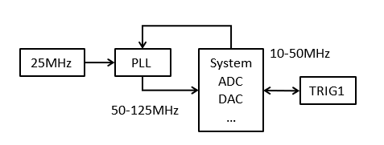

*Figure 5. Configuration d'horloge par défaut de l'AD3.*

L'AD3, et par conséquent la
[fréquence d'horloge système réglable](#fréquence-dhorloge-système-réglable),
peut aussi être utilisé avec une horloge de référence externe de 10 MHz à 50 MHz
appliquée sur Trigger 1 (T1). Le FPGA transmet directement l'horloge de
référence de T1 à la PLL dédiée, au lieu d'utiliser l'oscillateur de 25 MHz. Avec
une horloge de référence externe de 10 MHz, une gigue inférieure à 4 ps a été
observée sur l'horloge du CAN par rapport à l'oscillateur local.

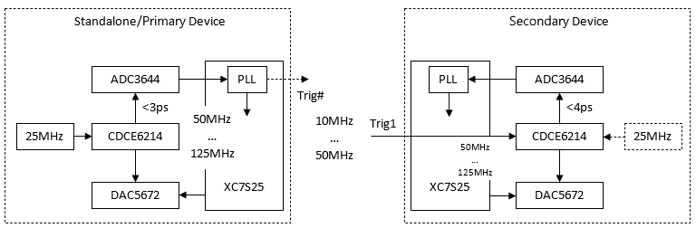

*Figure 6. Topologie d'horloge externe de l'AD3.*

Des informations complémentaires sur la broche de déclenchement figurent dans la
section [Système de déclenchement](#système-de-déclenchement) et dans les
[caractéristiques de l'Analog Discovery 3](https://digilent.com/reference/test-and-measurement/analog-discovery-3/specifications).

---

### Système de déclenchement

Chacun des principaux systèmes de l'AD3 — les entrées analogiques, les sorties
analogiques et les broches d'E/S numériques, pilotés respectivement par les
instruments Scope, Wavegen, Logic et Patterns — possède sa propre logique de
déclenchement, qui a accès aux deux broches de déclenchement physiques et au bus
de déclenchement central. Chaque instrument peut être déclenché par des
conditions qu'il génère lui-même ou par n'importe quel autre instrument. Par
exemple, une acquisition de l'analyseur logique peut être déclenchée sur la
valeur initiale connue d'un code d'erreur. Le début de l'acquisition logique
peut alors être acheminé par le bus de déclenchement jusqu'à l'instrument Scope,
qui se met à collecter des données analogiques pour observer la réaction du
système externe au code d'erreur.

Par défaut, les deux broches de déclenchement physiques sont configurées pour
recevoir un signal externe. Elles peuvent aussi émettre un déclenchement généré
par n'importe quel instrument du bus de déclenchement. La vitesse de balayage
(slew), la force d'attaque (drive) et le type de rappel (pull) des broches de
déclenchement peuvent aussi être réglés uniformément dans les
[paramètres des E/S numériques](#paramètres-des-es-numériques).

Le type de déclenchement peut être réglé sur « Auto » (réglage par défaut) :
si la condition de déclenchement n'est pas détectée dans un délai maximal de
deux secondes (au minimum le temps de maintien holdoff plus la durée spécifiée),
l'acquisition démarre automatiquement ; sur « Normal » : le système attend que la
condition soit remplie pour démarrer l'acquisition ; ou sur « None » :
l'acquisition démarre immédiatement.

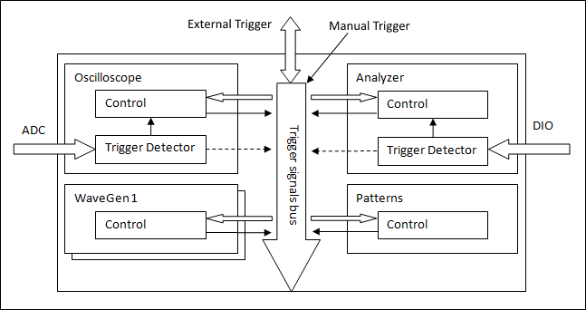

*Figure 5. Vue d'ensemble du système de déclenchement.*

Chacun de ces systèmes actifs passe par différents états pendant qu'il acquiert
ou génère un signal. Si plusieurs instances ou instruments du même type sont
ouverts, la dernière instance utilisée (déterminée par l'appui sur Run ou Stop
d'un instrument donné) contrôle l'état dans lequel se trouve l'Analog
Discovery 3. Les autres instruments qui partagent les mêmes ressources
matérielles affichent l'état Busy (occupé).

Les différents états des systèmes sont :

- Ready : l'instrument n'est pas en marche et prêt à être configuré
- Config : l'instrument est en cours de configuration et le tampon d'acquisition
  est prérempli de données
- Armed : l'instrument est armé et attend que l'événement de déclenchement défini
  par l'utilisateur se produise. Le tampon d'acquisition est prérempli de données
- Trig'd : l'acquisition est déclenchée selon une condition prédéfinie du système
  de déclenchement
- Auto : le délai de la condition de déclenchement est écoulé et l'acquisition a
  démarré automatiquement
- Wait : l'instrument attend une durée prédéfinie avant de démarrer son
  traitement (appelée Holdoff pour l'oscilloscope et l'analyseur logique)
- Done : l'acquisition est terminée
- Stop : l'instrument a été arrêté et se trouve remis à l'état prêt
- Scan : l'instrument fonctionne en mode d'écran défilant (scan screen) ou à
  décalage (shift)
- Error : un problème est survenu, par exemple si l'appareil a été déconnecté de
  l'ordinateur hôte

Les systèmes qui génèrent un signal, comme le
[générateur de signaux](#générateur-de-signaux) et le
[générateur de motifs](#générateur-de-motifs), disposent de paramètres de temps
d'attente, de durée d'exécution et de répétition, qui permettent de générer
facilement des séquences courtes et précises appelées signaux en salves (burst).

La figure 7 présente le diagramme d'états d'un des instruments générateurs. Le
système part de l'état Ready, est configuré, vérifie si l'utilisateur a demandé
le démarrage de la génération, puis arme le système avec le déclenchement
voulu, attend la durée indiquée avant de démarrer la génération du signal, génère
le signal pendant la durée demandée (en restant à l'état Run si l'option continu
a été choisie), puis vérifie si le nombre de répétitions du signal demandé est
atteint. S'il reste des répétitions ou si l'option de répétition infinie a été
choisie, le système retourne soit à l'état Armed pour attendre un nouveau
déclenchement, soit à l'état Wait si la source de déclenchement « None » a été
sélectionnée, avant de passer finalement à l'état Done. Si l'utilisateur arrête
le générateur avant d'atteindre l'état Done, l'état « Stop » est indiqué et
l'instrument est prêt à être reconfiguré ou à redémarrer.

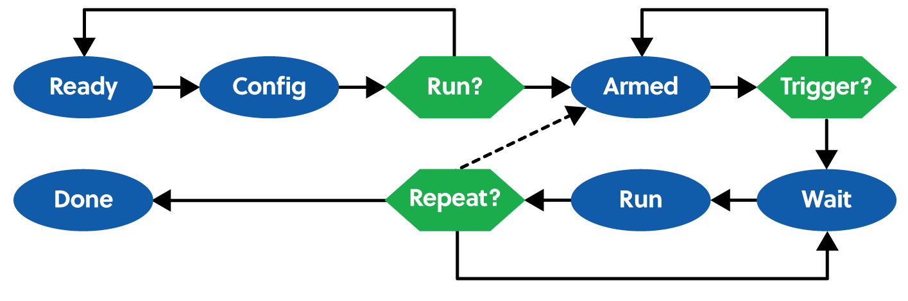

*Figure 7. Exemple de diagramme d'états d'un instrument générateur.*

Des informations complémentaires sur le système de déclenchement et sur les
caractéristiques électriques des broches de déclenchement physiques figurent
dans les
[caractéristiques de l'Analog Discovery 3](https://digilent.com/reference/test-and-measurement/analog-discovery-3/specifications).

> *Note du traducteur : dans la version originale, la légende de la vue
> d'ensemble du système de déclenchement porte, comme celle de l'horloge par
> défaut, le numéro « Figure 5 ». La numérotation d'origine a été conservée.*

---

### Configuration de l'appareil

L'Analog Discovery 3 propose plusieurs options de configuration, qui allouent
des tailles de tampon prédéfinies à chacun des principaux systèmes. Le tableau 1
récapitule les options de configuration proposées dans le gestionnaire d'appareils
de WaveForms (Device Manager).

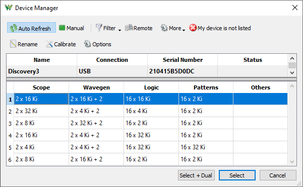

*Tableau 1 : options de configuration de l'Analog Discovery 3*

| N° de configuration | Oscilloscope | Générateur de signaux | Analyseur logique | Générateur de motifs |
|:---:|:---:|:---:|:---:|:---:|
| 1 | Tampon d'échantillons 16 bits de 16 KiS Tampon de bruit 14 bits de 1 KiS | Porteuse 14 bits de 16 KiS, tampons AM et FM 16 bits de 2 KiS ; deux tampons d'échantillons de générateur de signaux des alimentations de 2 KiS | Tampon d'échantillons 16 bits de 16 KiS | Tampon d'échantillons 16 bits de 2 KiS |
| 2 | Tampon d'échantillons 16 bits de 32 KiS Tampons de bruit de 1 KiS | Porteuse 14 bits de 4 KiS, tampons AM et FM 16 bits de 2 KiS ; deux tampons d'échantillons de générateur de signaux des alimentations de 1 KiS | Tampon d'échantillons 16 bits de 4 KiS | Tampon d'échantillons 16 bits de 2 KiS |
| 3 | Tampon d'échantillons 16 bits de 8 KiS Tampons de bruit 14 bits de 1 KiS | Porteuse 14 bits de 32 KiS, tampons AM et FM 16 bits de 2 KiS ; deux tampons d'échantillons de générateur de signaux des alimentations de 2 KiS | Tampon d'échantillons 16 bits de 2 KiS | Tampon d'échantillons 16 bits de 2 KiS |
| 4 | Tampon d'échantillons 16 bits de 16 KiS Tampons de bruit de 1 KiS | Porteuse 14 bits de 4 KiS, tampons AM et FM 16 bits de 2 KiS ; deux tampons d'échantillons de générateur de signaux des alimentations de 2 KiS | Tampon d'échantillons 16 bits de 32 KiS | Tampon d'échantillons 16 bits de 2 KiS |
| 5 | Tampon d'échantillons 16 bits de 4 KiS Tampons de bruit 14 bits de 1 KiS | Porteuse 14 bits de 4 KiS, tampons AM et FM 16 bits de 2 KiS ; deux tampons d'échantillons de générateur de signaux des alimentations de 1 KiS | Tampon d'échantillons 16 bits de 32 KiS | Tampon d'échantillons 16 bits de 32 KiS |
| 6 | Tampon d'échantillons 16 bits de 8 KiS Tampons de bruit de 1 KiS | Porteuse 14 bits de 16 KiS, tampons AM et FM 16 bits de 8 KiS ; deux tampons d'échantillons de générateur de signaux des alimentations de 4 KiS | Tampon d'échantillons 16 bits de 2 KiS | Tampon d'échantillons 16 bits de 2 KiS |

*KiS : kibi-échantillons (1 KiS = 1 024 échantillons).*

---

### Paramètres des E/S numériques

La vitesse de balayage (slew rate), la force d'attaque (drive) et le type de
rappel (pull) des 18 broches d'E/S numériques de l'Analog Discovery 3, c'est-à-dire
les 16 broches d'E/S partagées entre l'analyseur logique et le générateur de
motifs ainsi que les deux broches Trigger E/S, peuvent être réglés par
l'utilisateur dans les options de l'appareil (Device Options) ou dans
l'instrument Analyseur logique.

La vitesse de balayage peut être réglée sur lente (valeur par défaut) ou rapide.
La force d'attaque peut être réglée sur 4 mA (valeur par défaut), 8 mA, 12 mA ou
16 mA. Le type de rappel peut être réglé sur aucun (valeur par défaut),
pulldown, pullup ou keeper. Le réglage choisi s'applique à toutes les broches
d'E/S numériques de l'Analog Discovery 3.

Des informations complémentaires sur ces paramètres figurent dans le guide
d'utilisation Xilinx des ressources SelectIO des FPGA de la série 7,
[UG471](https://docs.xilinx.com/v/u/en-US/ug471_7Series_SelectIO) (en anglais),
dans la section « 7 Series FPGA SelectIO Attributes/Constraints ».

---

### Embase MTE

L'Analog Discovery 3 donne accès à ses entrées et sorties analogiques, à ses E/S
numériques et de déclenchement et à ses alimentations programmables par une
embase 2×15 broches au pas de 100 mil (2,54 mm). Ces broches sont facilement
accessibles avec le jeu de câbles MTE à code couleur fourni, ou avec l'un des
adaptateurs compatibles.

---

### États de la LED

La LED d'alimentation située à l'arrière de l'Analog Discovery 3 a quatre états
différents : allumée à pleine intensité lorsque les rails analogiques et
numériques sont tous deux actifs et alimentés ; faiblement allumée lorsque les
rails numériques sont alimentés mais que l'appareil n'est pas actif ; clignotante
en cas de défaut des alimentations (non illustré) ; et éteinte lorsque l'appareil
n'est pas alimenté.

| 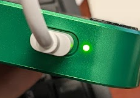 | 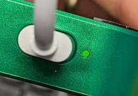 | 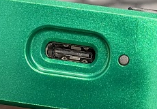 |
|:---:|:---:|:---:|
| *Figure 8. LED à pleine intensité lorsque les rails numériques et analogiques sont actifs.* | *Figure 9. LED faiblement allumée lorsque seuls les rails numériques sont activés mais que l'appareil n'est pas actif.* | *Figure 10. LED complètement éteinte, pour comparaison visuelle.* |
