# Manuel de référence de l'Analog Discovery Studio

> **Traduction française non officielle** de la page
> [Analog Discovery Studio Reference Manual](https://digilent.com/reference/test-and-measurement/analog-discovery-studio/hardware-reference-manual)
> de Digilent (© 2023 Digilent), d'après la copie de la
> [Wayback Machine du 13 décembre 2024](https://web.archive.org/web/20241213143223/https://digilent.com/reference/test-and-measurement/analog-discovery-studio/hardware-reference-manual).
> En cas de doute, seule la version originale en anglais fait foi.
>
> Ce document est placé, comme l'original, sous licence
> [Creative Commons Attribution – Pas d'Utilisation Commerciale – Partage dans les Mêmes Conditions 4.0 International](https://creativecommons.org/licenses/by-nc-sa/4.0/deed.fr)
> (CC BY-NC-SA 4.0) — voir le fichier [LICENSE](LICENSE). Les images sont
> copiées depuis le site de Digilent et restent soumises à la même licence.
> Modifications apportées : traduction en français, mise en forme Markdown,
> copie locale des images.

## Sommaire

- [Présentation](#présentation)
- [Tour d'horizon](#tour-dhorizon)
- [Oscilloscope](#oscilloscope)
- [Générateur de signaux](#générateur-de-signaux)
- [Alimentations](#alimentations)
- [Voltmètre](#voltmètre)
- [Enregistreur de données](#enregistreur-de-données)
- [Analyseur logique](#analyseur-logique)
- [Générateur de motifs](#générateur-de-motifs)
- [E/S numériques](#es-numériques)
- [Analyseur de spectre](#analyseur-de-spectre)
- [Analyseur de réseau](#analyseur-de-réseau)
- [Analyseur d'impédance](#analyseur-dimpédance)
- [Analyseur de protocoles](#analyseur-de-protocoles)
- [Éditeur de scripts WaveForms](#éditeur-de-scripts-waveforms)
- [Kit de développement logiciel (SDK) WaveForms](#kit-de-développement-logiciel-sdk-waveforms)

## Présentation

L'Analog Discovery Studio est équipé de 13 instruments de test et de mesure qui
offrent, dans un seul appareil, les fonctionnalités de tout un poste de travail
d'instrumentation. L'oscilloscope, le générateur de signaux, l'analyseur
logique, l'analyseur de protocoles, l'analyseur de spectre, les alimentations
et les autres instruments en font un laboratoire d'électronique qui peut être
déployé n'importe où. Sa conception physique fournit des connecteurs BNC ou des
câbles MTE pour les entrées et sorties analogiques, des câbles MTE pour les
E/S numériques, les déclenchements (triggers) et les alimentations, ainsi
qu'une grande surface de conception amovible, compatible avec une plaque
d'essai (breadboard), qui permet de réaliser une grande variété de montages et
de projets.

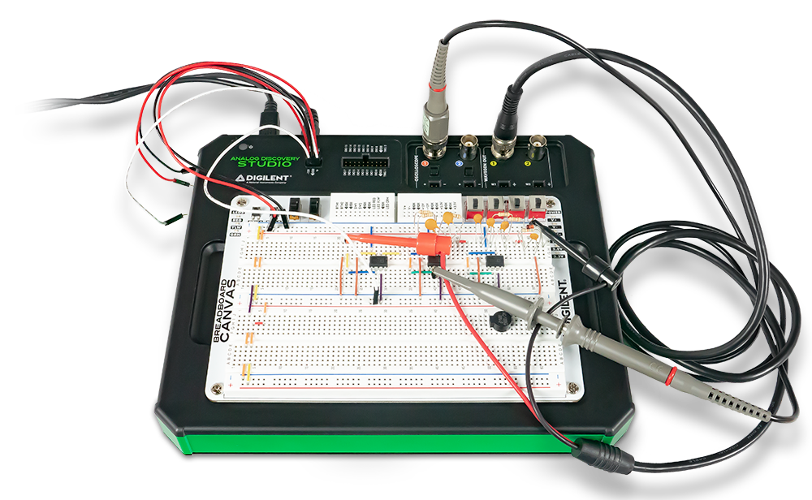

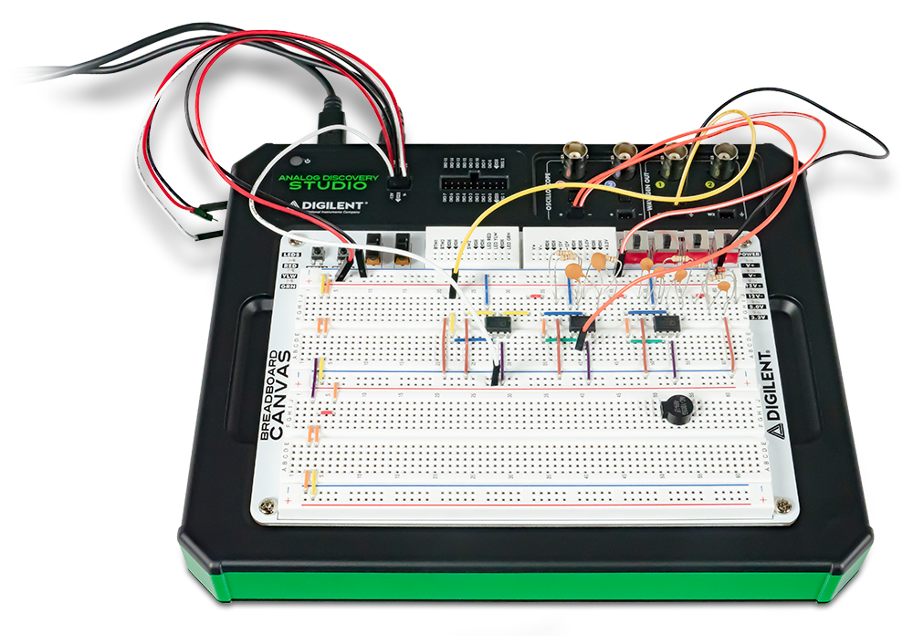

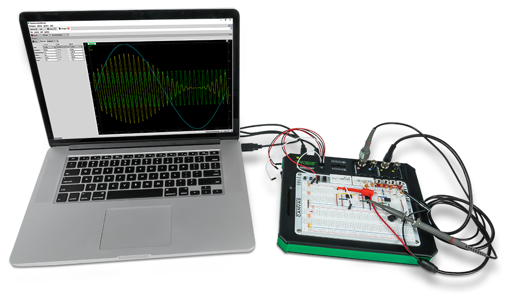

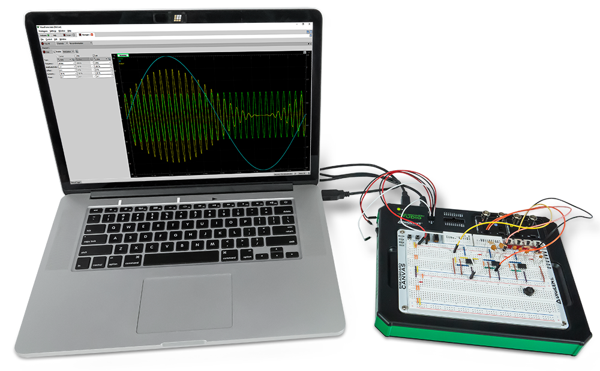

## Tour d'horizon

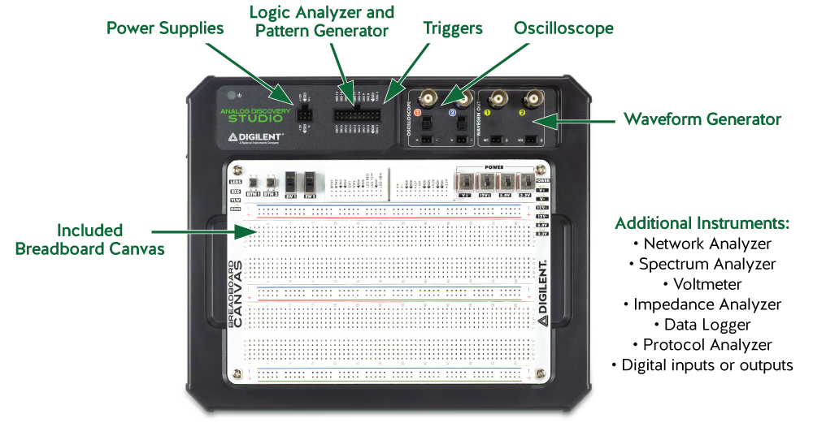

Consultez les [caractéristiques techniques](https://digilent.com/reference/test-and-measurement/analog-discovery-studio/specifications)
(en anglais).

## Oscilloscope

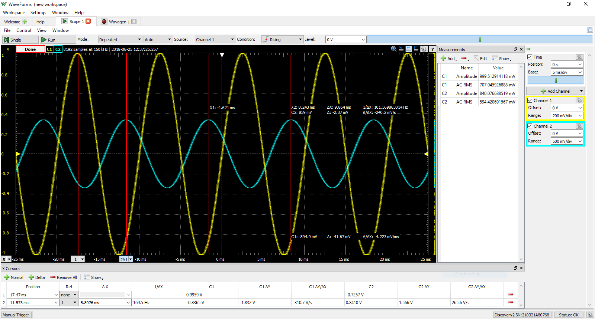

L'Analog Discovery Studio peut être utilisé avec l'instrument Oscilloscope de
WaveForms pour acquérir des données analogiques sur les canaux d'entrée
analogiques (« Scope »), avec des câbles BNC ou des câbles MTE. Dans ce cas, les
canaux d'entrée analogiques de l'Analog Discovery Studio fonctionnent comme un
oscilloscope à deux voies, 14 bits, 100 MS/s.

Avec des câbles BNC, les canaux de l'oscilloscope sont asymétriques
(single-ended) ; le circuit sous test doit toutefois partager une masse commune
avec l'Analog Discovery Studio. Avec des câbles BNC, les canaux d'entrée
analogiques ont une bande passante supérieure à 30 MHz.

Avec des câbles MTE, les broches **+** et **-** de chaque canal de
l'oscilloscope forment une paire différentielle. Les broches **-** peuvent être
reliées à un nœud du circuit qui n'est pas la masse, mais le circuit sous test
doit toujours partager une masse commune avec l'Analog Discovery Studio. Avec
des câbles MTE, les canaux d'entrée analogiques ont une bande passante de 9 MHz.

Les canaux d'entrée analogiques de l'Analog Discovery Studio étant partagés,
l'instrument Oscilloscope ne peut pas être utilisé en même temps que les
instruments Voltmètre, Enregistreur de données, Analyseur de spectre, Analyseur
de réseau ou Analyseur d'impédance.

Pour plus d'informations sur les canaux d'entrée analogiques (« Scope »),
consultez les [caractéristiques de l'Analog Discovery Studio](https://digilent.com/reference/test-and-measurement/analog-discovery-studio/specifications).
Pour une présentation pas à pas des fonctions de l'instrument Oscilloscope de
WaveForms, consultez le guide
[Using the Oscilloscope](https://digilent.com/reference/learn/instrumentation/tutorials/analog-discovery-studio-oscilloscope/start)
(en anglais).

### Caractéristiques

- Déclenchement : sur front, impulsion, transition, hystérésis, et bien d'autres
- Déclenchement croisé avec l'analyseur logique, le générateur de signaux, le
  générateur de motifs ou un déclencheur externe
- Modes d'échantillonnage : moyenne, décimation, min/max
- Visualisation de signaux mixtes (les signaux analogiques et numériques
  partagent le même volet d'affichage)
- Vues en temps réel : FFT, tracés XY, histogrammes, spectrogrammes, et autres
- Plusieurs voies mathématiques avec des fonctions complexes
- Curseurs avec mesures avancées
- Les données acquises peuvent être exportées dans des formats standard
- Les configurations de l'oscilloscope peuvent être enregistrées, exportées et
  importées

> **Remarque importante : mise à la masse du circuit**
> Bien que les canaux d'entrée analogiques de l'Analog Discovery Studio soient
> entièrement différentiels, une connexion de masse (GND) avec le circuit sous
> test est nécessaire pour fournir une tension de mode commun stable.
>
> La référence de masse (GND) de l'Analog Discovery Studio est reliée à la masse
> de l'USB. Selon le mode d'alimentation du PC et ses autres connexions
> (Ethernet, audio, etc., qui peuvent elles aussi être reliées à la terre), la
> référence de masse de l'Analog Discovery Studio peut se retrouver reliée à
> l'ensemble du système de masse et, au final, à la protection du réseau
> électrique (terre). Le circuit sous test peut lui aussi être relié à la terre
> ou, éventuellement, flottant.
>
> Pour des raisons de sécurité, il incombe à l'utilisateur de comprendre le
> schéma d'alimentation et de mise à la masse, de s'assurer qu'il existe une
> référence de masse commune entre l'Analog Discovery Studio et le circuit sous
> test, et que les tensions de mode commun et différentielle ne dépassent pas
> les valeurs spécifiées. De plus, pour obtenir des mesures sans distorsion, les
> tensions de mode commun et différentielle doivent respecter les
> spécifications.

---

## Générateur de signaux

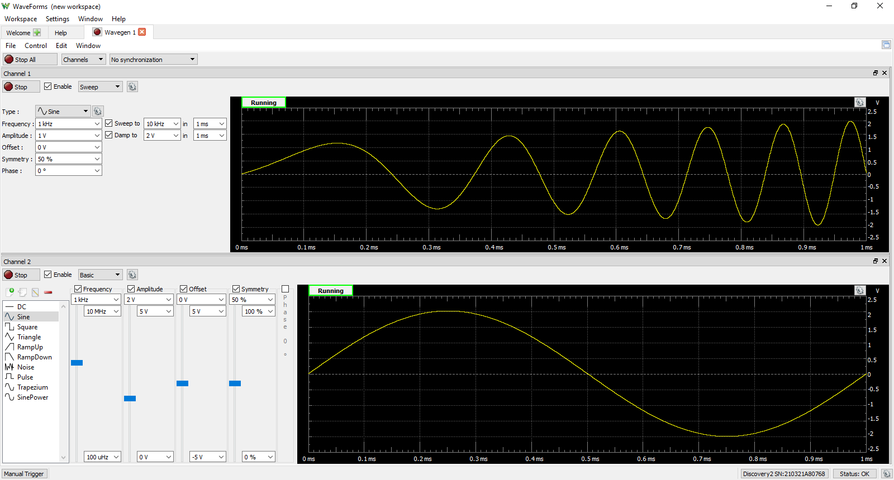

L'Analog Discovery Studio peut être utilisé avec l'instrument Waveform
Generator (générateur de signaux) de WaveForms pour produire des signaux de
tension analogiques, via des câbles BNC ou des câbles MTE. Le générateur
convertit des échantillons numériques de 14 bits en signal analogique, à une
cadence pouvant atteindre 100 MS/s sur chacune des deux voies. Lorsque cet
instrument est utilisé, les canaux de sortie analogiques de l'Analog Discovery
Studio fonctionnent comme un générateur de signaux arbitraires. L'instrument
gère aussi bien des signaux simples, comme les signaux sinusoïdaux et
triangulaires, que des fonctions plus élaborées, comme les modulations AM et FM.
L'utilisateur peut définir ses propres séries d'échantillons dans des
applications comme Excel, puis les importer dans WaveForms.

Chaque voie du générateur est considérée comme une broche asymétrique
(single-ended) ; un circuit connecté doit toutefois partager une masse avec
l'Analog Discovery Studio. Chaque voie a une bande passante de 8 MHz, aussi bien
sur les connecteurs BNC que sur les connecteurs MTE. Les amplitudes alternatives
de ±5 V et les décalages continus (offsets) de ±5 V sont pris en charge.

Les canaux de sortie analogiques de l'Analog Discovery Studio étant partagés,
l'instrument Générateur de signaux ne peut pas être utilisé en même temps que
les instruments Analyseur de réseau ou Analyseur d'impédance.

Pour plus d'informations sur les canaux de sortie analogiques (« Wavegen »),
consultez les [caractéristiques de l'Analog Discovery Studio](https://digilent.com/reference/test-and-measurement/analog-discovery-studio/specifications).
Pour une présentation pas à pas des fonctions de l'instrument Générateur de
signaux de WaveForms, consultez le guide
[Using the Waveform Generator](https://digilent.com/reference/learn/instrumentation/tutorials/analog-discovery-studio-waveform-generator/start)
(en anglais).

### Caractéristiques

- Signaux standard : sinus, triangle, dent de scie, bruit, et bien d'autres
- Signaux avancés : balayages (sweeps), AM, FM
- Signaux arbitraires définis par l'utilisateur : dans l'interface du logiciel
  WaveForms ou avec des outils standard (par exemple Excel)

---

## Alimentations

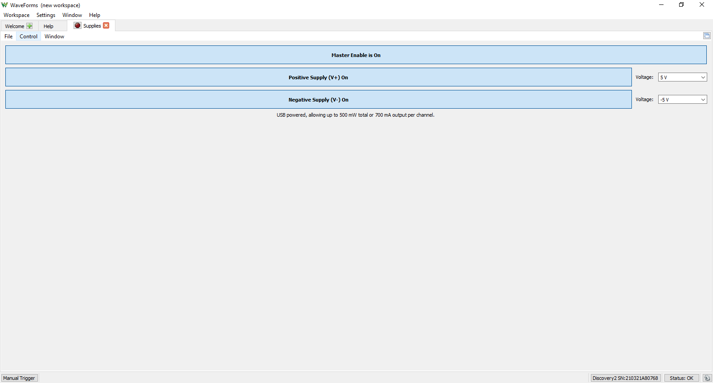

L'Analog Discovery Studio dispose de plusieurs rails d'alimentation qui peuvent
servir à alimenter les circuits sous test. Les rails **V+** et **V-** sont
variables, les autres sont fixes. Les rails fixes sont récapitulés dans le
tableau ci-dessous :

| Repère | Tension     | Courant maximal |
|--------|-------------|-----------------|
| +12V   | 12 V ±5 %   | 0,2 A           |
| -12V   | -12 V ±5 %  | 0,2 A           |
| 5.0V   | 5 V ±5 %    | 1,0 A           |
| 3.3V   | 3,3 V ±5 %  | 1,0 A           |

**Remarque** : les rails d'alimentation 3,3 V et 5,0 V ne sont disponibles que
sur les broches situées sur le Canvas.

L'Analog Discovery Studio dispose également de deux rails d'alimentation
variables, repérés **V+** et **V-**, qui se règlent respectivement entre 1 et
5 V et entre -1 et -5 V grâce à l'instrument « Supplies » (Alimentations) de
WaveForms. Chacune de ces alimentations peut fournir au maximum 2,1 W ou 700 mA.

Remarque : retirez la mousse de protection située sous le Canvas de prototypage
(Breadboard Canvas) avant d'utiliser les alimentations.

Pour plus d'informations sur l'utilisation des alimentations programmables,
consultez les [caractéristiques de l'Analog Discovery Studio](https://digilent.com/reference/test-and-measurement/analog-discovery-studio/specifications).
Pour une présentation pas à pas des fonctions de l'instrument Alimentations de
WaveForms, consultez le guide
[Using the Power Supplies](https://digilent.com/reference/learn/instrumentation/tutorials/analog-discovery-studio-supplies/start)
(en anglais).

### Caractéristiques

- Plusieurs rails d'alimentation à tension fixe (+12 V, -12 V, 5 V, 3,3 V)
- Rails d'alimentation programmables (1 V…5 V ou -1 V…-5 V)

---

## Voltmètre

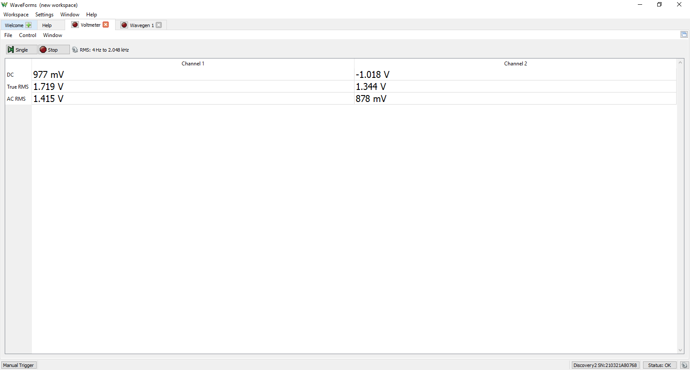

Les broches d'entrée analogiques de l'Analog Discovery Studio peuvent être
utilisées avec l'instrument Voltmètre de WaveForms pour réaliser un voltmètre
simple. Les tensions continues, les tensions alternatives efficaces (AC RMS) et
les tensions efficaces vraies (True RMS) peuvent être affichées pour chacune des
deux voies Scope.

Les canaux d'entrée analogiques de l'Analog Discovery Studio étant partagés,
l'instrument Voltmètre ne peut pas être utilisé en même temps que les
instruments Oscilloscope, Enregistreur de données, Analyseur de spectre,
Analyseur de réseau ou Analyseur d'impédance.

Pour plus d'informations sur les canaux d'entrée analogiques (« Scope »),
consultez les [caractéristiques de l'Analog Discovery Studio](https://digilent.com/reference/test-and-measurement/analog-discovery-studio/specifications).
Pour une présentation pas à pas des fonctions de l'instrument Voltmètre de
WaveForms, consultez le guide
[Using the Voltmeter](https://digilent.com/reference/learn/instrumentation/tutorials/analog-discovery-studio-voltmeter/start)
(en anglais).

### Caractéristiques

- Mesures : DC, AC RMS, True RMS

---

## Enregistreur de données

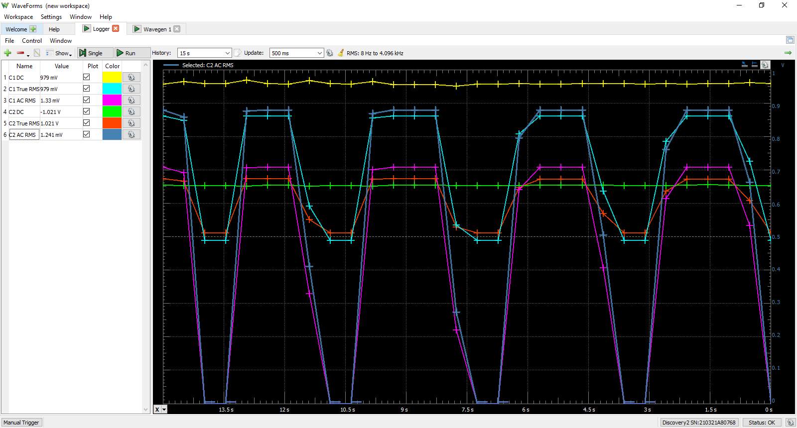

L'Analog Discovery Studio peut être utilisé avec l'instrument « Logger »
(enregistreur de données) de WaveForms pour capturer de grands volumes de
données analogiques sur les broches Scope.

L'enregistreur de données peut capturer des données à des cadences de mise à
jour allant jusqu'à 10 échantillons par seconde. La durée maximale d'un
enregistrement dépend de la cadence de mise à jour mais, à l'extrême, il peut
durer plus de mille heures.

Les canaux d'entrée analogiques de l'Analog Discovery Studio étant partagés,
l'instrument Enregistreur de données ne peut pas être utilisé en même temps que
les instruments Oscilloscope, Voltmètre, Analyseur de spectre, Analyseur de
réseau ou Analyseur d'impédance.

Pour plus d'informations sur les canaux d'entrée analogiques (« Scope »),
consultez les [caractéristiques de l'Analog Discovery Studio](https://digilent.com/reference/test-and-measurement/analog-discovery-studio/specifications).
Pour une présentation pas à pas des fonctions de l'instrument Enregistreur de
données de WaveForms, consultez le guide
[Using the Data Logger](https://digilent.com/reference/learn/instrumentation/tutorials/analog-discovery-studio-data-logger)
(en anglais).

### Caractéristiques

- Mesures : DC, AC RMS, True RMS, avec moyennes, minimums et maximums
- Jusqu'à 24 heures de données enregistrées à une cadence de 1 Hz
- Fonctions de conversion programmables par script

---

## Analyseur logique

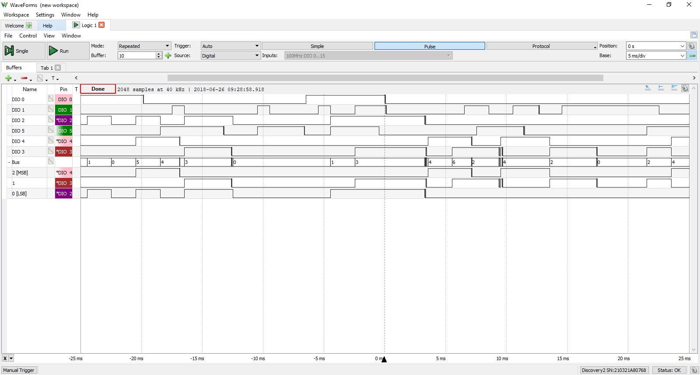

L'Analog Discovery Studio peut être utilisé avec l'instrument « Logic » de
WaveForms comme analyseur logique. Dans ce cas, les 16 canaux d'entrée/sortie
numériques sont configurés pour capturer les états logiques haut/bas des broches
connectées, à une cadence d'échantillonnage pouvant atteindre 100 MS/s. Ces
canaux peuvent s'interfacer avec des signaux logiques 3,3 V et 1,8 V, et
tolèrent des tensions jusqu'à 5 V.

Les canaux d'entrée/sortie peuvent être regroupés en bus et en protocoles. Les
groupes de protocoles permettent d'afficher le contenu décodé des paquets de
nombreux protocoles de communication courants, notamment SPI, I2C, UART, CAN et
I2S.

Les états des signaux, les valeurs de bus décodées et les protocoles décodés
peuvent servir à déclencher une capture de l'analyseur logique. Les
déclenchements sur protocole comprennent des événements propres à chaque
protocole, comme le début de transmission, la fin de transmission ou un contenu
de paquet correspondant à une valeur donnée.

Les canaux d'entrée/sortie numériques utilisés par l'instrument Analyseur
logique peuvent toujours être utilisés par d'autres instruments qui se servent
des mêmes canaux.

Pour plus d'informations sur les canaux d'entrée/sortie numériques, consultez
les [caractéristiques de l'Analog Discovery Studio](https://digilent.com/reference/test-and-measurement/analog-discovery-studio/specifications).
Pour une présentation pas à pas des fonctions de l'instrument Analyseur logique
de WaveForms, consultez le guide
[Using the Logic Analyzer](https://digilent.com/reference/learn/instrumentation/tutorials/analog-discovery-studio-logic-analyzer/start)
(en anglais).

### Caractéristiques

- Nombreuses options de déclenchement, dont le changement d'état d'une broche, un
  motif sur un bus, et bien d'autres
- Déclenchement croisé entre les canaux d'entrée analogiques, l'analyseur
  logique, le générateur de motifs ou un déclencheur externe
- Interpréteur pour les bus SPI, I2C, UART, CAN, I2S, 1-Wire et les bus
  parallèles
- Protocoles personnalisés définis par script
- Import/export de fichiers de données dans des formats standard

---

## Générateur de motifs

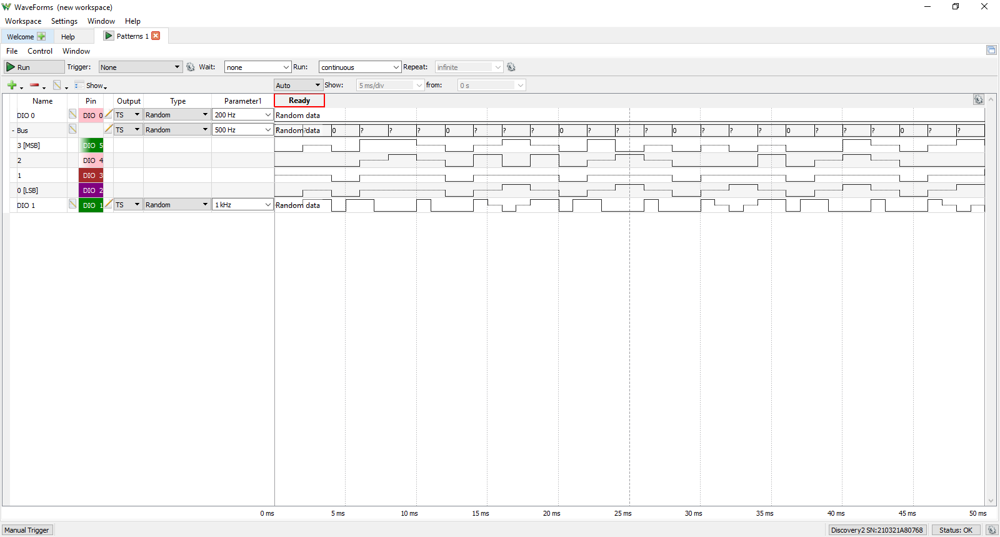

L'Analog Discovery Studio peut être utilisé avec l'instrument « Patterns » de
WaveForms pour générer des séquences de signaux logiques sur les broches
d'entrée/sortie numériques.

Les broches peuvent être configurées en logique push-pull, drain ouvert, source
ouverte ou trois états. Le niveau de tension de sortie à l'état haut est de
3,3 V. Les cadences d'échantillonnage peuvent atteindre 100 MS/s.

Les canaux d'entrée/sortie numériques utilisés par l'instrument Générateur de
motifs peuvent toujours être utilisés par d'autres instruments qui se servent
des mêmes canaux ; toutefois, les autres instruments ne peuvent utiliser ces
canaux partagés qu'en entrée.

Pour plus d'informations sur les canaux d'entrée/sortie numériques, consultez
les [caractéristiques de l'Analog Discovery Studio](https://digilent.com/reference/test-and-measurement/analog-discovery-studio/specifications).
Pour une présentation pas à pas des fonctions de l'instrument Générateur de
motifs de WaveForms, consultez le guide
[Using the Pattern Generator](https://digilent.com/reference/learn/instrumentation/tutorials/analog-discovery-studio-pattern-generator)
(en anglais).

### Caractéristiques

- Visualisation personnalisée des signaux et des bus
- Motifs définis par l'utilisateur : logique de type ROM à table de vérité
- Import/export de fichiers de données dans des formats standard

---

## E/S numériques

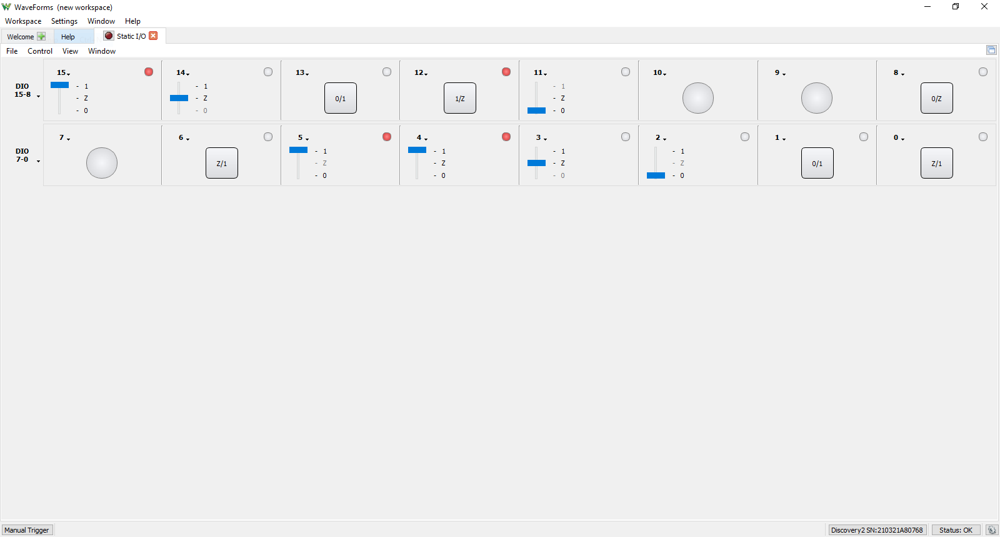

L'Analog Discovery Studio peut être utilisé avec l'instrument « Static I/O »
(E/S statiques) de WaveForms pour émuler divers dispositifs d'entrée/sortie
utilisateur sur les broches d'entrée/sortie numériques. Des LED, boutons,
interrupteurs, curseurs et afficheurs virtuels peuvent être affectés à des
broches d'E/S numériques précises, puis manipulés dans l'interface de WaveForms.

Les canaux d'entrée/sortie numériques de l'Analog Discovery Studio utilisent
une logique 3,3 V en sortie et acceptent en entrée des signaux logiques 1,8 V ou
3,3 V. Les broches d'entrée/sortie numériques tolèrent des signaux d'entrée
jusqu'à 5 V.

**Remarque importante :** *pour éviter d'endommager l'appareil, veillez à ne
jamais appliquer aux canaux d'entrée/sortie numériques des signaux d'entrée
supérieurs à 5 V.*

Les canaux d'entrée/sortie numériques utilisés par l'instrument E/S statiques
peuvent toujours être utilisés par d'autres instruments qui se servent des
mêmes canaux ; toutefois, les autres instruments ne peuvent utiliser ces canaux
partagés qu'en entrée.

Pour plus d'informations sur les canaux d'entrée/sortie numériques, consultez
les [caractéristiques de l'Analog Discovery Studio](https://digilent.com/reference/test-and-measurement/analog-discovery-studio/specifications).
Pour une présentation pas à pas des fonctions de l'instrument E/S statiques de
WaveForms, consultez le guide
[Using the Digital I/O](https://digilent.com/reference/learn/instrumentation/tutorials/analog-discovery-studio-digital-io)
(en anglais).

### Caractéristiques

- Dispositifs d'E/S virtuels (LED, boutons, interrupteurs et afficheurs)
- Options de visualisation personnalisables

---

## Analyseur de spectre

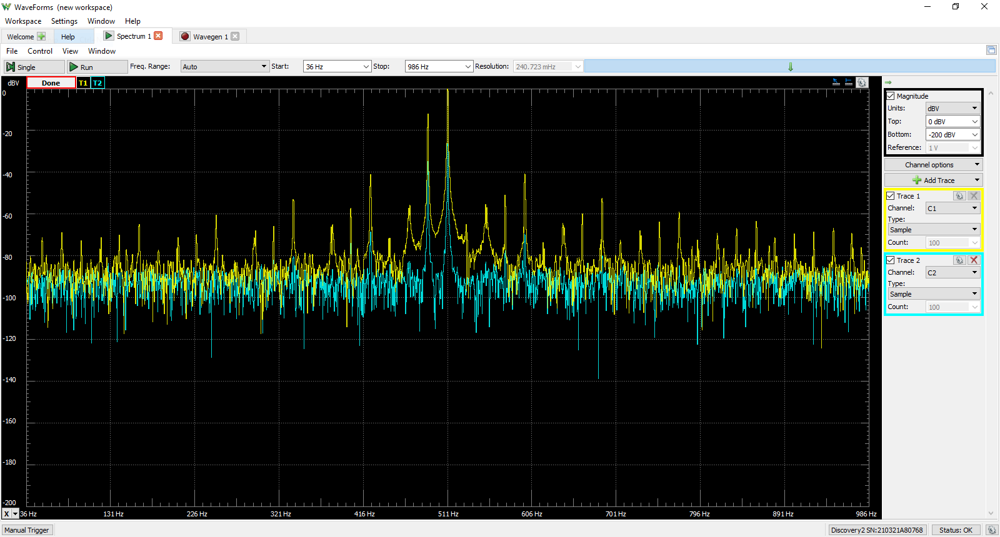

L'Analog Discovery Studio peut être utilisé avec l'instrument « Spectrum » de
WaveForms pour visualiser la puissance des composantes fréquentielles des
signaux analogiques capturés sur les canaux d'entrée analogiques.

Les signaux dont les fréquences minimale et maximale sont comprises entre 0 Hz
et 50 MHz peuvent être tracés en tension crête, en tension efficace ou dans
diverses unités de rapport de niveaux de tension.

Comme l'instrument Analyseur de spectre utilise les mêmes ressources matérielles
que les instruments Oscilloscope, Analyseur de réseau et Analyseur d'impédance,
il ne peut pas être utilisé en même temps que ces derniers.

Les canaux d'entrée analogiques de l'Analog Discovery Studio étant partagés,
l'instrument Analyseur de spectre ne peut pas être utilisé en même temps que les
instruments Oscilloscope, Voltmètre, Enregistreur de données, Analyseur de
réseau ou Analyseur d'impédance.

> *Note du traducteur : dans la version originale, cette phrase désigne par
> erreur l'instrument Oscilloscope comme sujet ; le sens évident est celui
> donné ci-dessus.*

Pour plus d'informations sur les canaux d'entrée analogiques, consultez les
[caractéristiques de l'Analog Discovery Studio](https://digilent.com/reference/test-and-measurement/analog-discovery-studio/specifications).
Pour une présentation pas à pas des fonctions de l'instrument Analyseur de
spectre de WaveForms, consultez le guide
[Using the Spectrum Analyzer](https://digilent.com/reference/learn/instrumentation/tutorials/analog-discovery-studio-spectrum-analyzer)
(en anglais).

### Caractéristiques

- Algorithmes de spectre de puissance : FFT, CZT
- Modes de plage de fréquences : centre/étendue, début/fin
- Échelles de fréquence : linéaire, logarithmique
- Options de l'axe vertical : tension crête, tension efficace, dBV et dBu
- Fenêtrage : rectangulaire, triangulaire, Hamming, cosinus, et bien d'autres
- Curseurs et mesures automatiques : plancher de bruit, SFDR, SNR, THD, et bien
  d'autres
- Import/export de fichiers de données dans des formats standard

---

## Analyseur de réseau

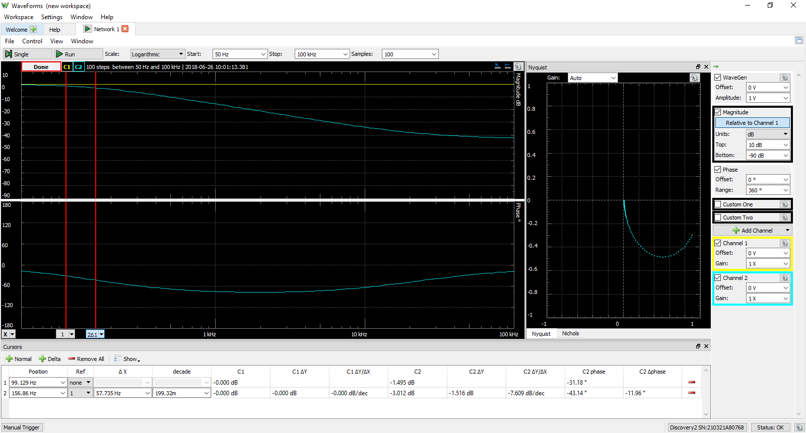

L'Analog Discovery Studio peut être utilisé avec l'instrument « Network » de
WaveForms pour visualiser la réponse en amplitude et en phase d'un circuit sous
test. Cet instrument permet aussi d'afficher des diagrammes de Nichols et de
Nyquist.

Des balayages en fréquence peuvent être réalisés dans des plages comprises entre
1 mHz et 10 MHz, avec jusqu'à 10 000 échantillons par décade. Le signal utilisé
pour le balayage est personnalisable et utilise les mêmes ressources que
l'instrument Générateur de signaux.

L'instrument Analyseur de réseau utilise les canaux de sortie analogiques et les
canaux d'entrée analogiques de l'Analog Discovery Studio pour sonder un circuit
de test. Il peut être configuré pour utiliser un signal externe comme entrée du
circuit sous test, au lieu des canaux de sortie analogiques.

Les canaux d'entrée et de sortie analogiques de l'Analog Discovery Studio étant
partagés, l'instrument Analyseur de réseau ne peut pas être utilisé en même
temps que les instruments Oscilloscope, Générateur de signaux, Voltmètre,
Enregistreur de données, Analyseur de spectre ou Analyseur d'impédance.

Pour plus d'informations sur les canaux de sortie et d'entrée analogiques,
consultez les [caractéristiques de l'Analog Discovery Studio](https://digilent.com/reference/test-and-measurement/analog-discovery-studio/specifications).
Pour une présentation pas à pas des fonctions de l'instrument Analyseur de
réseau de WaveForms, consultez le guide
[Using the Network Analyzer](https://digilent.com/reference/learn/instrumentation/tutorials/analog-discovery-studio-network-analyzer)
(en anglais).

### Caractéristiques

- Diagrammes disponibles : Bode, Nichols, Nyquist et FFT
- Amplitude et offset d'entrée réglables
- L'entrée analogique enregistre la réponse à chaque fréquence

---

## Analyseur d'impédance

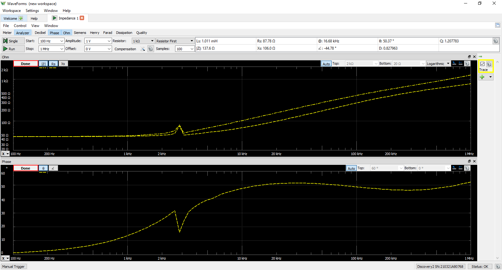

L'Analog Discovery Studio peut être utilisé avec l'instrument « Impedance » de
WaveForms pour visualiser un large éventail de caractéristiques de la réponse en
fréquence d'un circuit sous test. Les tracés Entrée, Phase, Tension, Courant,
Impédance, Admittance, Inductance, Facteur et Nyquist sont tous disponibles. Des
tracés personnalisés permettent en outre de présenter le résultat de nombreuses
opérations mathématiques sur les données mises en mémoire tampon.

Des balayages en fréquence peuvent être réalisés dans des plages comprises entre
100 µHz et 25 MHz, avec jusqu'à 10 000 échantillons par décade. Le signal
utilisé pour le balayage peut être choisi parmi plusieurs préréglages, avec une
amplitude et un offset configurables. Un circuit de référence externe pour
l'analyseur de réseau peut être sélectionné parmi plusieurs options.

L'instrument Analyseur d'impédance utilise les canaux de sortie analogiques et
les canaux d'entrée analogiques de l'Analog Discovery Studio pour sonder un
circuit de test.

Les canaux d'entrée et de sortie analogiques de l'Analog Discovery Studio étant
partagés, l'instrument Analyseur d'impédance ne peut pas être utilisé en même
temps que les instruments Oscilloscope, Générateur de signaux, Voltmètre,
Enregistreur de données, Analyseur de spectre ou Analyseur de réseau.

Pour plus d'informations sur les canaux de sortie et d'entrée analogiques,
consultez les [caractéristiques de l'Analog Discovery Studio](https://digilent.com/reference/test-and-measurement/analog-discovery-studio/specifications).
Pour une présentation pas à pas des fonctions de l'instrument Analyseur
d'impédance de WaveForms, consultez le guide
[Using the Impedance Analyzer](https://digilent.com/reference/learn/instrumentation/tutorials/analog-discovery-studio-impedance-analyzer)
(en anglais).

### Caractéristiques

- Graphiques pour la tension, le courant, l'impédance, l'admittance, la
  capacité, et bien d'autres
- Vue Mètre simplifiée en alternative
- Circuit de compensation externe sélectionnable
- Export de fichiers de données dans des formats standard

---

## Analyseur de protocoles

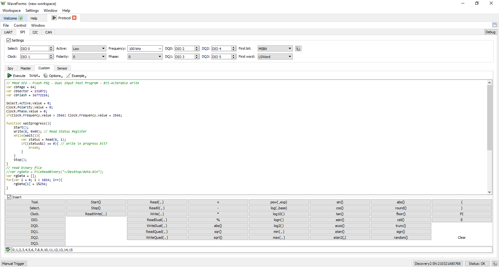

L'Analog Discovery Studio peut être utilisé avec l'instrument « Protocol » de
WaveForms pour travailler avec les protocoles de communication courants. Des
transactions UART, SPI, I2C et CAN peuvent être reçues, émises et/ou espionnées
par l'Analog Discovery Studio sur n'importe lequel des 16 canaux d'entrée/sortie
numériques, à une cadence d'échantillonnage de 100 MS/s.

Des scripts personnalisés peuvent être écrits dans l'instrument Analyseur de
protocoles pour générer des séquences de transactions SPI ou I2C.

Comme il utilise les mêmes ressources matérielles que les instruments Analyseur
logique et Générateur de motifs, l'Analyseur de protocoles ne peut pas être
utilisé en même temps que ces derniers.

Pour plus d'informations sur les canaux d'entrée/sortie numériques, consultez
les [caractéristiques de l'Analog Discovery Studio](https://digilent.com/reference/test-and-measurement/analog-discovery-studio/specifications).
Pour une présentation pas à pas des fonctions de l'instrument Analyseur de
protocoles de WaveForms, consultez le guide
[Using the Protocol Analyzer](https://digilent.com/reference/learn/instrumentation/tutorials/analog-discovery-studio-protocol-analyzer/start)
(en anglais).

### Caractéristiques

- Prise en charge des protocoles UART, SPI, I2C et CAN
- Séquences de transactions SPI et I2C programmables par script
- Débits, modes et autres paramètres configurables
- Envoi/réception directement depuis/vers des fichiers de données

---

## Éditeur de scripts WaveForms

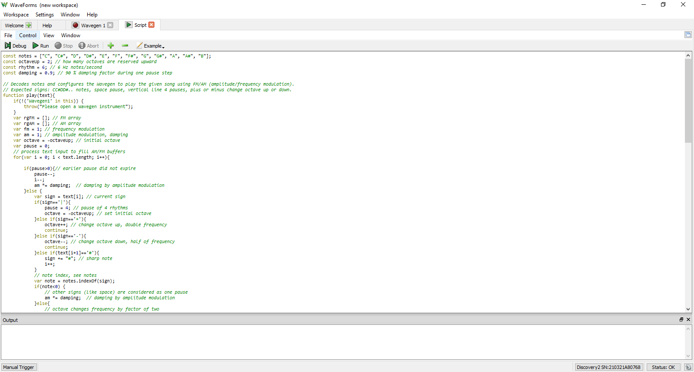

Chacun des instruments de WaveForms peut être piloté par des scripts, dans
l'application WaveForms elle-même. L'instrument « Script » de WaveForms permet à
l'utilisateur d'écrire et d'exécuter du code JavaScript qui pilote le reste de
l'application grâce à une API étendue. Il est ainsi possible de configurer et de
faire fonctionner simultanément de nombreux instruments, de façon facilement
reproductible.

De nombreux exemples de code sont disponibles dans l'application pour aider à
apprendre à écrire des scripts WaveForms. D'autres ressources pour l'écriture de
scripts se trouvent dans la section Test and Measurement du
[forum Digilent](https://forum.digilent.com/) (en anglais).

Un volet de tracé intégré à l'instrument Script permet de regrouper les données
de nombreux instruments et de les afficher de façon très personnalisable.

Pour une présentation pas à pas des fonctions de l'instrument Script de
WaveForms, consultez le guide
[Using Scripts](https://digilent.com/reference/test-and-measurement/guides/waveforms-script-editor)
(en anglais).

### Caractéristiques

- Disponible dans l'application WaveForms
- Pilotage simultané de tous les instruments en JavaScript
- Actions de l'interface graphique automatisables
- Fonctions personnalisées d'analyse et de traitement des données

---

## Kit de développement logiciel (SDK) WaveForms

Le SDK WaveForms est un ensemble de bibliothèques logicielles et d'exemples qui
permettent de développer des applications personnalisées pilotant les appareils
de test et de mesure Digilent. Les langages pris en charge sont C, C++, C#,
Visual Basic et Python. Des boîtes à outils tierces sont disponibles pour
LabVIEW et MATLAB. Les instructions pour utiliser WaveForms avec LabVIEW sont
données dans le guide
[Getting Started with LabVIEW and a Test and Measurement Device](https://digilent.com/reference/test-and-measurement/guides/getting-started-with-labview)
(en anglais). Le paquet de prise en charge de MATLAB est disponible sur le
[site de MathWorks](https://www.mathworks.com/matlabcentral/fileexchange/122817-digilent-toolbox).
Pour en savoir plus sur le SDK WaveForms, consultez le
[manuel de référence du SDK WaveForms](https://digilent.com/reference/software/waveforms/waveforms-sdk/reference-manual-legacy)
(en anglais).

### Caractéristiques

- Téléchargé avec l'installateur WaveForms, utilisé indépendamment de
  l'application WaveForms
- Langages pris en charge : C/C++, C#, MATLAB, Python, Visual Basic
- Permet de piloter les canaux matériels et les instruments virtuels depuis des
  applications personnalisées
